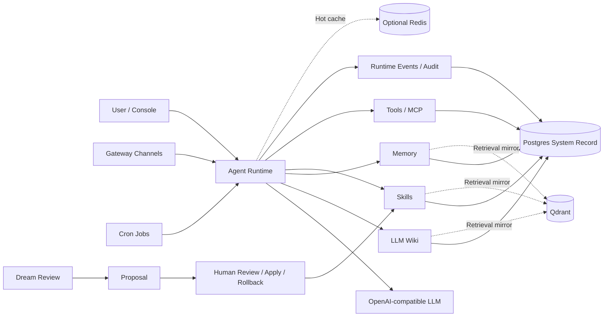
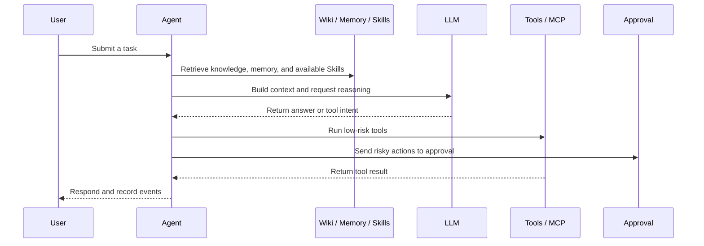
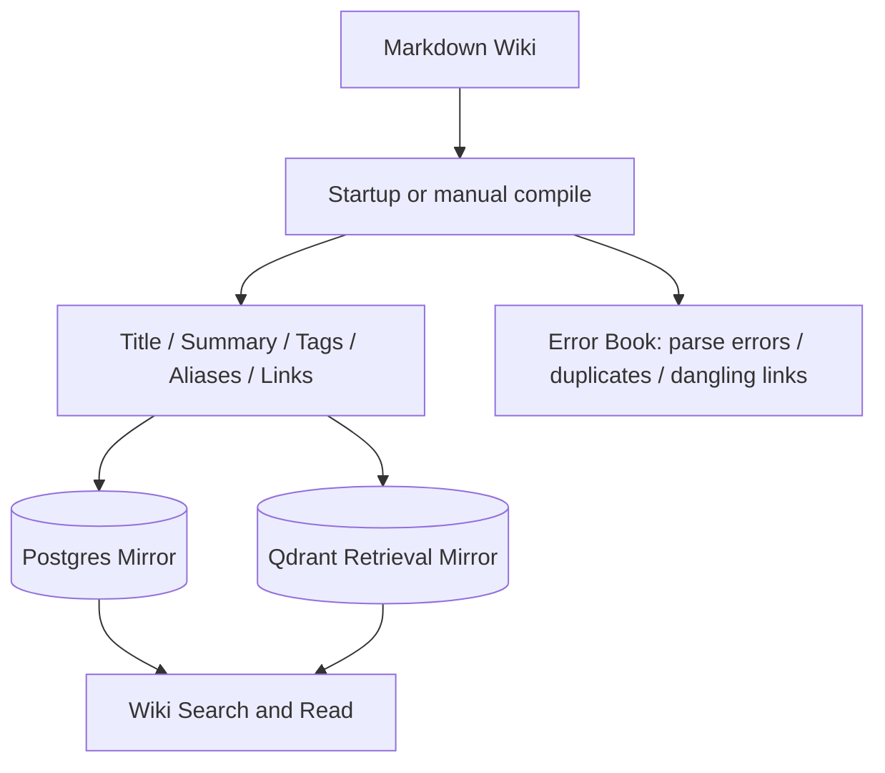
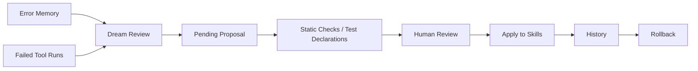
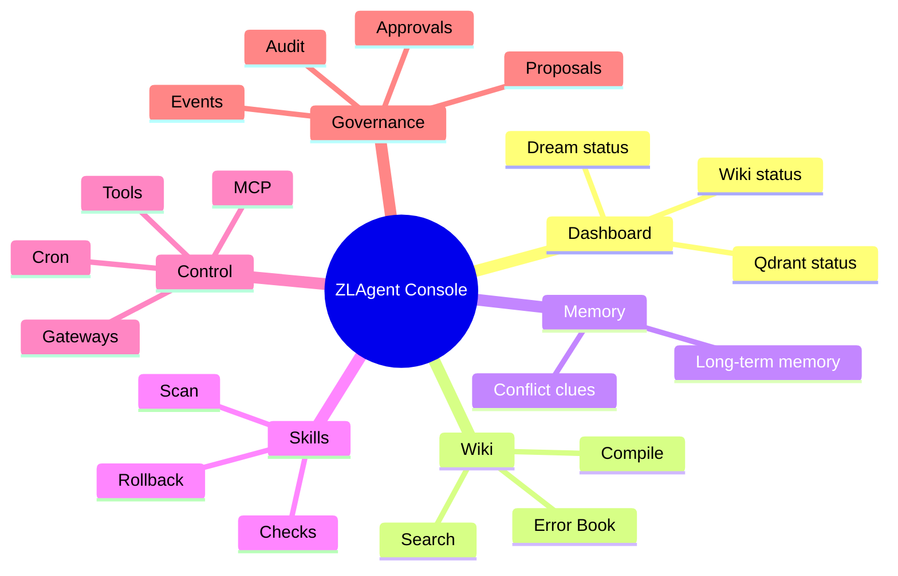

# ZLAgent

[中文](README.md)


ZLAgent is a personal AI Agent platform for long-term use. It brings durable knowledge, memory, Skills, tools, MCP, Gateway, Cron, Approval, and Dream review into one observable, auditable, and reversible workspace.

It is not just a chat proxy. ZLAgent is closer to a personal Agent operating system with long-term context: Markdown Wiki keeps stable knowledge, Memory stores experience, Skills preserve reusable capabilities, Tools/MCP/Gateway connect the outside world, and Approval plus Proposal keep risky changes inside a human review boundary.



## Core Features

| Capability | What it does | Design focus |
|---|---|---|
| LLM Wiki | Maintains long-term knowledge in Markdown, with search, read, links, and an error book | Markdown is the source of truth; Postgres and Qdrant are rebuildable mirrors |
| Memory | Stores long-term memories, error signals, tool experience, and conflict clues | Searchable, verifiable evidence for future reviews |
| Skills | Manages reusable capability packages for stable workflows | Scan, archive, lint, proposal apply, history, and rollback |
| Tools | Routes tool calls through one registry, run log, and safety boundary | Every call has status, result, and audit context |
| MCP | Connects external MCP servers and exposes discovered capabilities as tools | Startup refresh is on by default; external actions still follow Approval policy |
| Gateway | Connects external message channels for inbound work and controlled outbound sends | Disabled by default and explicitly enabled by the user |
| Cron | Runs scheduled jobs such as Dream review | Observable, disable-able, and tracks next run time |
| Dream | Turns error Memory and failed tool runs into improvement proposals | Scheduled by default; creates Proposal only |
| Approval | Adds human confirmation for external writes, risky actions, and Proposal application | Keeps automation inside an auditable boundary |
| Console | Shows Wiki, Memory, Skills, Tools, Cron, MCP, Gateway, Proposals, Approvals, Runs, Audit, and Settings | One place to observe and control the platform |

## Design Overview

### One Agent Turn



### Wiki Compile Path



### Dream Evolution Loop



## Default Runtime Policy

ZLAgent defaults to "core capabilities on, external risk explicit."

| Item | Default | Notes |
|---|---:|---|
| Wiki startup compile | On | Compiles Markdown Wiki on startup. Failures do not block service and are recorded as runtime events |
| Skills startup scan | On | Scans Skills and rebuilds indexes on startup. Failures do not block service |
| Dream scheduled review | On | Runs every day at `03:30 Asia/Shanghai`; creates Proposal only |
| Qdrant | On | Retrieval mirror for Wiki, Memory, and Skills; falls back to Postgres when unavailable |
| Redis | Optional | Used as a hot cache. Missing Redis does not block startup |
| MCP refresh | On | Discovers MCP tools automatically; tool calls still follow Approval policy |
| Gateway | Off | External channels must be explicitly enabled |

Key settings:

```env
ZLAGENT_BOOTSTRAP_WIKI_ON_STARTUP=true
ZLAGENT_BOOTSTRAP_SKILLS_ON_STARTUP=true
ZLAGENT_DREAM_REVIEW_ENABLED=true
ZLAGENT_DREAM_REVIEW_CRON=30 3 * * *
ZLAGENT_DREAM_REVIEW_TIMEZONE=Asia/Shanghai
ZLAGENT_QDRANT_ENABLED=true
ZLAGENT_MCP_REFRESH_ON_STARTUP=true
```

## Quick Start

### Docker

```bash
cp .env.example .env
docker compose up -d --build
```

Open:

- Console: <http://localhost:8020>
- Health check: <http://localhost:8020/api/health>

Default admin credentials come from `.env`:

```env
ZLAGENT_ADMIN_USERNAME=admin
ZLAGENT_ADMIN_PASSWORD=zlagent-admin
```

Configure an OpenAI-compatible LLM for full Agent behavior:

```env
OPENAI_API_KEY=<your-llm-api-key>
OPENAI_BASE_URL=https://api.openai.com/v1
OPENAI_MODEL=<your-model>
```

Without an LLM key, the service still starts and keeps retrieval, status, and management features available.

### Local Development

```bash
python -m venv .venv
source .venv/bin/activate
pip install -e ".[dev]"
docker compose up -d postgres qdrant
uvicorn backend.app:app --host 127.0.0.1 --port 8020
```

Frontend development:

```bash
npm install --prefix frontend
npm run dev --prefix frontend
```

## Operations

### Prerequisites

| Dependency | Version | Required | Notes |
|---|---|---|---|
| Python | 3.11+ | Yes | Required for local development |
| Docker Desktop | Current stable | Recommended | Brings up the app, Postgres, Qdrant, and Redis |
| Git | Any | Yes | Clone the repository |
| Node.js / npm | 20+ | Recommended | Many MCP servers are distributed via npm |
| `uv` / `uvx` | Current stable | Recommended | Common for Python-based MCP servers |

ZLAgent uses an OpenAI-compatible API. Without an LLM key, the service still starts, but the Agent can only return retrieval and runtime-status responses.

### Observe

```bash
curl http://localhost:8020/api/health
docker compose logs -f zlagent
```

Default services:

| Service | Port | Purpose |
|---|---|---|
| `zlagent` | 8020 | FastAPI + console |
| `zlagent-postgres` | 5432 | System record |
| `zlagent-qdrant` | 6333 / 6334 | Wiki, Memory, and Skills retrieval mirror |
| `zlagent-redis` | 6379 | Optional hot cache |

### Console

- Dashboard: Wiki counts, error count, Qdrant status, Dream review status.
- Wiki: compile, search, error book.
- Memory: long-term memories and new entries.
- Skills: scan and inspect Skills.
- Tools: tool catalog and availability.
- Cron: scheduled jobs, including the system Dream review job.
- MCP: MCP server configuration and discovery status.
- Gateways: external message channels.
- Proposals: Dream-generated and manually created pending improvements.
- Approvals: external writes that need human confirmation.
- Runs / Audit / Settings: runtime history, audit trail, and configuration status.

### Common Issues

| Symptom | Check |
|---|---|
| `/api/health` fails | Run `docker compose ps` and confirm the `zlagent` container is healthy |
| Login fails | Confirm the admin username and password in `.env` match the seeded admin user |
| LLM does not answer | Check `OPENAI_API_KEY`, `OPENAI_BASE_URL`, and `OPENAI_MODEL` |
| Qdrant shows Degraded | Confirm the Qdrant container is running and the first FastEmbed model download finished |
| Redis is unavailable | Safe to ignore; Redis is a hot cache, not a startup dependency |
| Dream does not run automatically | Check whether `system-dream-review` is enabled in Cron and whether Settings shows the next run time |
| MCP tools are unavailable | Check whether the MCP server is enabled, refresh succeeded, and the tool was blocked by Approval |
| Gateway send fails | Check whether the Gateway is enabled and whether the webhook/Slack endpoint is valid |

### Stop / Cleanup

Keep data:

```bash
docker compose stop
docker compose down
```

Remove volumes:

```bash
docker compose down -v
```

That clears Postgres, Qdrant, Redis, and workspace volumes.

## Workspace Layout

| Path | Purpose |
|---|---|
| `workspace/knowledge/wiki` | Markdown source of truth for the LLM Wiki |
| `workspace/skills` | Skills repository |
| `config/mcp_servers.yaml` | MCP server configuration entry |
| `data` | Local runtime data, cache, and model cache |
| `.env.example` | Recommended configuration template |

## Console Map



## Maturity Assessment

| Area | Implemented | Needs more work | Assessment |
|---|---|---|---|
| LLM Wiki | Markdown source, metadata, aliases, tags, links, error book, Postgres mirror, Qdrant retrieval, Wiki search and read | Automatic incremental compilation from raw sources, fact-level provenance, catalog browsing policy, evidence sufficiency checks, automatic error-book repair loop | Solid platform foundation, but not yet the full retrieval-as-reasoning form described in the LLM-Wiki paper |
| Dream memory evolution | Generates Proposal from error Memory and failed tool runs, without automatic application | Long-term memory consolidation, deduplication, pruning, category migration, replay validation, and failure recovery | Safety boundary is right; currently closer to a proposal generator than a full memory metabolism system |
| Skills | Scan, archive, static safety checks, Proposal application, history, and rollback | Runtime Skills selection, progressive file loading, command-style invocation, self-learning loop, and verifiable reuse | Repository management is clear, but Hermes-style on-demand loading and self-learning are still future work |
| External tool governance | Unified Tools, MCP, Gateway, Cron, Approval, runtime events, and audit | Finer permission policy, cross-tool risk scoring, and end-to-end replay tests | A governable control plane is in place and ready to expand |

## Relationship to Current Agent Designs

- LLM-Wiki: ZLAgent follows the direction of structured Wiki plus retrieval mirror plus error book, but it is currently a platform foundation rather than a full paper-grade knowledge compiler.
- Hermes / Agent Skills: ZLAgent treats Skills as long-term capability assets. Runtime selection, progressive loading, and self-learning still need more work.
- nanobot Dream: ZLAgent uses a conservative Dream review policy so the system can learn from failures while avoiding unattended self-modification.

References:

- LLM-Wiki paper: <https://arxiv.org/html/2605.25480v2>
- Hermes Skills: <https://hermes-agent.nousresearch.com/docs/user-guide/features/skills>
- Agent Skills specification: <https://agentskills.io/specification>
- nanobot Dream template: <https://github.com/HKUDS/nanobot/blob/main/nanobot/templates/agent/dream.md>
- nanobot project: <https://github.com/HKUDS/nanobot>

## Verification

```bash
PYTHONPATH=. pytest -q
ruff check backend tests
npm run build --prefix frontend
```

## License

MIT License. See [LICENSE](LICENSE).
