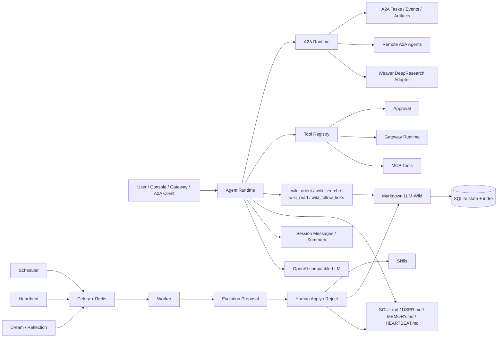

# SoulClaw

[中文](README.md)


SoulClaw is a local-first long-term personal AI agent and an A2A multi-agent orchestration node. It brings session continuity, Markdown-authoritative memory, Agent-native LLM-Wiki, skills, tools/MCP/gateways, approvals, Dream/Reflection, Heartbeat, background job queues, and A2A delegation into one observable console.

The current architecture no longer uses Qdrant/chunk candidate retrieval as the default path. Long-lived content is authoritative in Markdown files, while SQLite stores local state, rebuildable indexes, audit trails, background jobs, and A2A task state. Search only locates pages or memories; evidence should be read through `wiki_read` or `memory_get`. Tracked templates live in `workspace_seed/`; real runtime context lives in the private local `workspace/` directory. Startup merges missing seed files without overwriting user data.

A2A and MCP have separate jobs here: MCP connects tools and data sources; A2A coordinates coarse-grained specialist agents such as DeepResearch, document-project, scheduling, and coding agents that need trackable task lifecycles and artifacts. The first implementation already includes an A2A runtime, Agent Card, JSON-RPC endpoint, persistent tasks/events/artifacts, and a Weaver DeepResearch compatibility adapter.



## Current Capabilities

| Area | Current state |
|---|---|
| Session continuity | `session_messages` stores user/assistant/tool messages; `session_summaries` stores rolling summaries |
| Authoritative Markdown files | Auto-initializes `SOUL.md`, `USER.md`, `memory/MEMORY.md`, `memory/history.jsonl`, and `HEARTBEAT.md` |
| LLM-Wiki | Markdown is the source of truth; database tables store pages, links, Error Book entries, compile state, and health |
| Wiki tools | `wiki_orient` reads schema/index/log/page map; `wiki_search` searches the page index; `wiki_read` reads full pages; `wiki_follow_links` traverses links |
| Memory | `memory_search` locates memories; `memory_get` reads them; creating memory appends to `MEMORY.md` |
| Skills | Scan, lint, proposal apply/reject, history, and rollback |
| Tools/MCP/Gateway | Unified tool registry and audit; risky tools require approval; gateways support inbound/send/HMAC/heartbeat status |
| A2A multi-agent | Publishes a local Agent Card; supports JSON-RPC `message/send`, `tasks/get`, `tasks/cancel`, `tasks/resubscribe`; persists connections, tasks, events, and artifacts |
| Weaver DeepResearch | Default connection name is `weaver-deep-research`; adapts Weaver `/api/research/sse` into DeepResearch progress, cancellation, final reports, and evidence artifacts |
| Dream/Reflection | Runs in Celery workers and creates pending proposals instead of editing files directly |
| Heartbeat | Periodically reads `HEARTBEAT.md` Active Tasks and creates review proposals or skipped history |
| Background jobs | `dream_review`, `heartbeat_check`, `wiki_compile`, `wiki_lint`, `skill_scan`, and `mcp_refresh` run through Celery/Redis |
| Safety | Proposal decisions, tool approvals, workspace file edits, cron/mcp/gateway/a2a writes are audited |

## A2A Multi-Agent

SoulClaw acts as an orchestrator and delegates complex work to independent agents instead of treating external agents as in-process functions. It currently exposes:

```text
GET  /.well-known/agent-card.json
GET  /.well-known/agent-card
GET  /api/a2a/card
POST /api/a2a
```

`POST /api/a2a` is the public JSON-RPC endpoint. Supported methods:

```text
message/send
message/stream
tasks/get
tasks/cancel
tasks/resubscribe
tasks/list
agent/getAuthenticatedExtendedCard
```

Authenticated admin APIs:

```text
GET  /api/a2a/connections
POST /api/a2a/connections
POST /api/a2a/connections/{connection_name}/discover
POST /api/a2a/delegate
GET  /api/a2a/tasks
GET  /api/a2a/tasks/{task_id}
POST /api/a2a/tasks/{task_id}/cancel
GET  /api/a2a/tasks/{task_id}/events
```

Default DeepResearch adapter settings:

```env
SOULCLAW_A2A_BOOTSTRAP_WEAVER_ENABLED=true
SOULCLAW_A2A_WEAVER_BASE_URL=http://127.0.0.1:8001
SOULCLAW_A2A_WEAVER_INTERNAL_API_KEY=
SOULCLAW_A2A_WEAVER_AUTH_USER_HEADER=X-Weaver-User
SOULCLAW_A2A_WEAVER_USER_ID=soulclaw
```

Low-risk reading and research delegation can run automatically. High-risk capabilities such as code writing, calendar changes, external sending, and document writes are routed through the existing Approval system. The stricter next step is to expose a native A2A server or sidecar for Weaver itself so SoulClaw can discover `/.well-known/agent-card.json` and stop relying on Weaver's private API adapter.

## LLM-Wiki Retrieval

Default path:

```text
wiki_orient -> wiki_search page index -> wiki_read page evidence -> wiki_follow_links multi-hop -> answer
```

`wiki_search` does not return chunks, snippets, or `candidate_only`; it returns page-level index records. The Agent should call `wiki_read` before relying on Wiki facts. If it searches or traverses Wiki without reading a page, runtime emits `wiki.retrieval_guard.warning`.

Recommended Wiki runtime layout is `workspace/knowledge/wiki/`; the tracked seed lives in `workspace_seed/knowledge/wiki/`:

```text
workspace_seed/knowledge/wiki/
  SCHEMA.md
  index.md
  log.md
  raw/
  entities/
  concepts/
  comparisons/
  queries/
  _archive/
```

## Long-Term Files

SoulClaw follows the long-lived file style found in projects such as OpenClaw, Hermes, and nanobot. The tracked seed is:

```text
workspace_seed/
  SOUL.md
  USER.md
  HEARTBEAT.md
  memory/
    MEMORY.md
    history.jsonl
  knowledge/wiki/
  skills/
```

At startup it is merged into the private local runtime directory:

```text
workspace/
  SOUL.md
  USER.md
  HEARTBEAT.md
  memory/
    MEMORY.md
    history.jsonl
  knowledge/wiki/
  skills/
```

These Markdown files are authoritative for identity, user profile, durable memory, and proactive tasks. Database records are indexes, status, jobs, audit, and observability mirrors. `workspace/` is ignored by default so real personal context stays local.

## Quick Start

### Conda Local Development

The current local development environment is the conda environment named `soulclaw`:

```bash
conda activate soulclaw
python -m pip install -e ".[dev]"
PYTHONPATH=. uvicorn backend.app:app --host 127.0.0.1 --port 8020
```

Frontend development:

```bash
npm install --prefix frontend
npm run dev --prefix frontend
```

Worker:

```bash
conda run -n soulclaw env PYTHONPATH=. celery -A backend.worker.celery_app.celery_app worker --loglevel=INFO --concurrency=1
```

Scheduler:

```bash
conda run -n soulclaw env PYTHONPATH=. python -m backend.worker.scheduler
```

### Docker Compose

```bash
cp .env.example .env
docker compose up -d --build
```

Default services:

| Service | Purpose |
|---|---|
| `soulclaw` | FastAPI + frontend console |
| `soulclaw-worker` | Celery worker |
| `soulclaw-scheduler` | Scans `cron_jobs` and enqueues due tasks |
| `soulclaw-redis` | Celery broker/result backend |
| `soulclaw-postgres` | Optional Postgres/pgvector profile, not required by default |

SQLite data defaults to `data/soulclaw.sqlite3`. Postgres remains available as an optional production/server backend via `SOULCLAW_DATABASE_URL`. The current project directory is:

```text
/home/song/code/Agent/assistant/SoulClaw
```

Open:

- Console: <http://localhost:8020>
- Health check: <http://localhost:8020/api/health>
- Agent Card: <http://localhost:8020/.well-known/agent-card.json>

Default development account:

```env
SOULCLAW_ADMIN_USERNAME=admin
SOULCLAW_ADMIN_PASSWORD=soulclaw-admin
```

Production deployments must change `SOULCLAW_JWT_SECRET`, `SOULCLAW_ADMIN_PASSWORD`, and use explicit CORS origins.

## Key APIs

```text
POST    /api/auth/login
GET     /api/health

GET/PUT /api/workspace/files/{soul|user|memory|heartbeat}

GET     /api/wiki/orient
GET     /api/wiki/search?q=...
POST    /api/wiki/search
GET     /api/wiki/read?page_key=...
POST    /api/wiki/compile
POST    /api/wiki/lint

GET     /api/memory
POST    /api/memory
POST    /api/memory/search
GET     /api/memory/get?memory_id=...

GET     /api/tools
POST    /api/tools/{tool_name}/run
GET     /api/approvals
POST    /api/approvals/{approval_id}/approve-and-run

GET     /api/a2a/connections
POST    /api/a2a/delegate
GET     /api/a2a/tasks
POST    /api/a2a/tasks/{task_id}/cancel
POST    /api/a2a

GET     /api/mcp
POST    /api/mcp/refresh
GET     /api/gateways/status
POST    /api/gateways/inbound
POST    /api/gateways/send

GET     /api/jobs
POST    /api/jobs/{job_id}/cancel
POST    /api/heartbeat/run
GET     /api/heartbeat/status
POST    /api/evolution/proposals/{id}/apply
```

## Verification

```bash
conda run -n soulclaw env PYTHONPATH=. pytest -q
conda run -n soulclaw env PYTHONPATH=. ruff check backend tests
npm run build --prefix frontend
```

Current baseline:

```text
68 passed
All checks passed
frontend build passed
```

## References

- A2A specification: <https://a2a-protocol.org/latest/specification/>
- A2A and MCP: <https://a2a-protocol.org/latest/topics/a2a-and-mcp/>
- Agent Discovery: <https://a2a-protocol.org/latest/topics/agent-discovery/>
- A2A Python SDK: <https://github.com/a2aproject/a2a-python>
- LLM-Wiki paper: <https://arxiv.org/abs/2605.25480>
- Hermes LLM-Wiki skill: <https://github.com/NousResearch/hermes-agent/blob/main/skills/research/llm-wiki/SKILL.md>
- nanobot: <https://github.com/HKUDS/nanobot>
- Celery periodic tasks: <https://docs.celeryq.dev/en/stable/userguide/periodic-tasks.html>
