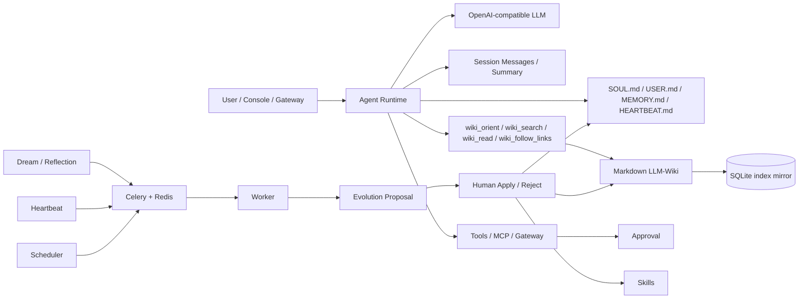

# ZLAgent

[中文](README.md)


ZLAgent is a local-first long-term personal AI agent. It brings session continuity, Markdown-authoritative memory, Agent-native LLM-Wiki, skills, tools/MCP/gateways, approvals, Dream/Reflection, Heartbeat, and background job queues into one observable console.

The current architecture no longer uses Qdrant/chunk candidate retrieval as the default path. Long-lived content is authoritative in Markdown files, while SQLite stores local state and rebuildable indexes. Search only locates pages or memories; evidence must be read through `wiki_read` or `memory_get`. Default long-term content lives in `workspace_seed/`; the real runtime workspace is the local private `workspace/` directory. Startup merges missing seed files without overwriting user data.



## Current Capabilities

| Area | Current state |
|---|---|
| Session continuity | `session_messages` stores user/assistant/tool messages; `session_summaries` stores rolling summaries |
| Authoritative Markdown files | Auto-initializes `SOUL.md`, `USER.md`, `memory/MEMORY.md`, `memory/history.jsonl`, and `HEARTBEAT.md` |
| LLM-Wiki | Markdown is the source of truth; SQLite/DB tables store pages, links, Error Book, and compile status |
| Wiki tools | `wiki_orient` reads schema/index/log/page map; `wiki_search` searches page index; `wiki_read` reads full pages; `wiki_follow_links` traverses links |
| Memory | `memory_search` locates memories; `memory_get` reads them; creating memory appends to `MEMORY.md` |
| Dream/Reflection | Runs in Celery workers and creates pending proposals instead of editing files directly |
| Heartbeat | Periodically reads `HEARTBEAT.md` Active Tasks and creates review proposals or skipped history |
| Skills | Scan, lint, proposal apply/reject, history, and rollback |
| Tools/MCP/Gateway | Unified tool registry and audit; risky tools require approval; gateways support inbound/send/HMAC/heartbeat status |
| Safety | Proposal decisions, tool approvals, workspace file edits, cron/mcp/gateway writes are audited |

## LLM-Wiki Retrieval

Default path:

```text
wiki_orient -> wiki_search page index -> wiki_read page evidence -> wiki_follow_links multi-hop -> answer
```

`wiki_search` does not return chunks, snippets, or `candidate_only`. It returns page-level index records. The Agent should call `wiki_read` before relying on Wiki facts. If it searches or traverses Wiki without reading a page, runtime emits `wiki.retrieval_guard.warning`.

Recommended Wiki runtime layout is `workspace/knowledge/wiki/`; the tracked seed lives in `workspace_seed/knowledge/wiki/`:

```text
workspace_seed/knowledge/wiki/
  SCHEMA.md
  index.md
  log.md
  raw/
  entities/
  concepts/
  comparisons/
  queries/
  _archive/
```

## Long-Term Files

ZLAgent follows the long-lived file style found in projects such as OpenClaw, Hermes, and nanobot. The tracked seed is:

```text
workspace_seed/
  SOUL.md
  USER.md
  HEARTBEAT.md
  memory/
    MEMORY.md
    history.jsonl
  knowledge/wiki/
  skills/
```

At startup it is merged into the local private runtime directory:

```text
workspace/
  SOUL.md
  USER.md
  HEARTBEAT.md
  memory/
    MEMORY.md
    history.jsonl
  knowledge/wiki/
  skills/
```

These Markdown files are authoritative for identity, user profile, durable memory, and proactive tasks. Database records are indexes, status, jobs, audit, and observability mirrors. `workspace/` is ignored by default so real personal context stays local.

## Background Jobs

Heavy work runs through Celery + Redis. FastAPI handles conversations, console actions, approvals, and status queries.

| task_name | Purpose |
|---|---|
| `dream_review` | Scans error memories, failed ToolRuns, low-stability memories, and creates proposals |
| `heartbeat_check` | Reads `HEARTBEAT.md` Active Tasks and creates heartbeat proposals or skipped records |
| `wiki_compile` | Compiles Markdown Wiki into local page/link/Error Book indexes |
| `wiki_lint` | Checks broken links, orphan pages, missing index entries, low confidence, and source drift |
| `skill_scan` | Scans skills and rebuilds the file index |
| `mcp_refresh` | Refreshes MCP server tool caches |

## Quick Start

### Docker Compose

```bash
cp .env.example .env
docker compose up -d --build
```

Default services:

| Service | Purpose |
|---|---|
| `zlagent` | FastAPI + frontend console |
| `zlagent-worker` | Celery worker |
| `zlagent-scheduler` | Scans `cron_jobs` and enqueues due tasks |
| `zlagent-redis` | Celery broker/result backend |

SQLite data defaults to `data/zlagent.sqlite3`. Postgres remains available as an optional production/server backend via `ZLAGENT_DATABASE_URL`.

Open:

- Console: <http://localhost:8020>
- Health check: <http://localhost:8020/api/health>

Default development account:

```env
ZLAGENT_ADMIN_USERNAME=admin
ZLAGENT_ADMIN_PASSWORD=zlagent-admin
```

### Local Development

```bash
conda activate zlagent
python -m pip install -e ".[dev]"
PYTHONPATH=. uvicorn backend.app:app --host 127.0.0.1 --port 8020
```

Worker:

```bash
conda run -n zlagent env PYTHONPATH=. celery -A backend.worker.celery_app.celery_app worker --loglevel=INFO --concurrency=1
```

Scheduler:

```bash
conda run -n zlagent env PYTHONPATH=. python -m backend.worker.scheduler
```

Frontend:

```bash
npm install --prefix frontend
npm run dev --prefix frontend
```

## Key APIs

```text
GET/PUT /api/workspace/files/{soul|user|memory|heartbeat}
POST    /api/memory/search
GET     /api/memory/get?memory_id=...
GET     /api/wiki/search
GET     /api/wiki/read?page_key=...
POST    /api/heartbeat/run
GET     /api/heartbeat/status
POST    /api/gateways/{name}/heartbeat
GET     /api/gateways/status
GET     /api/jobs
POST    /api/evolution/proposals/{id}/apply
```

## Verification

```bash
conda run -n zlagent env PYTHONPATH=. pytest -q
cd frontend && npm run build
```

## References

- LLM-Wiki paper: <https://arxiv.org/abs/2605.25480>
- Hermes LLM-Wiki skill: <https://github.com/NousResearch/hermes-agent/blob/main/skills/research/llm-wiki/SKILL.md>
- nanobot: <https://github.com/HKUDS/nanobot>
- Celery periodic tasks: <https://docs.celeryq.dev/en/stable/userguide/periodic-tasks.html>
