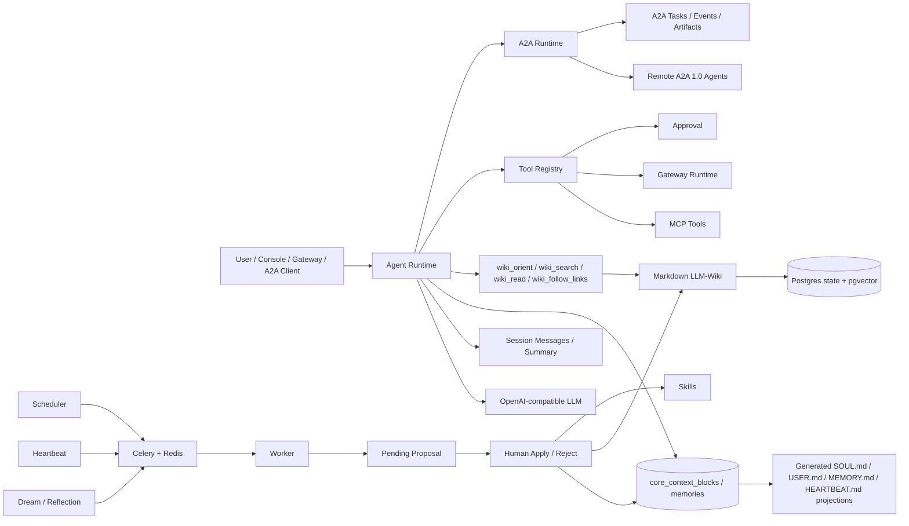

# SoulClaw

[中文](README.md)


SoulClaw is a LangGraph-oriented long-term personal AI agent platform and an A2A multi-agent orchestration node. It brings session continuity, Postgres-authoritative long-term state, Agent-native LLM-Wiki, skills, tools/MCP/gateways, unified policy approvals, vector retrieval, Dream/Reflection, Heartbeat, background job queues, and A2A delegation into one observable console.

Long-lived state is authoritative in Postgres: `core_context_blocks` manages `soul/user/heartbeat`, `memories` manages the durable memory ledger, and changes land through evidence/proposal/apply. Markdown files are readable projections and draft inputs only. Search locates pages or memories; evidence should be read through `wiki_read` or `memory_get`. Tracked templates live in `workspace_seed/`; runtime projections live in the private local `workspace/` directory. Startup merges missing seed files without overwriting user data.

A2A and MCP have separate jobs here: MCP connects tools and data sources; A2A coordinates coarse-grained specialist agents such as DeepResearch, document-project, scheduling, and coding agents that need trackable task lifecycles and artifacts. SoulClaw includes an A2A 1.0 runtime, Agent Card, JSON-RPC endpoint, and persistent tasks/events/artifacts.



## Capabilities

| Area | Description |
|---|---|
| Session continuity | `session_messages` stores user/assistant/tool messages; `session_summaries` stores rolling summaries |
| Structured long-term state | `core_context_blocks` manages soul/user/heartbeat, `memories` manages durable memory; Markdown is projection and draft input only |
| LLM-Wiki | Markdown is the source of truth; database tables store pages, links, Error Book entries, compile state, and health |
| Wiki tools | `wiki_orient` reads schema/index/log/page map; `wiki_search` searches the page index; `wiki_read` reads full pages; `wiki_follow_links` traverses links |
| Memory | `memory_search` locates memories; `memory_get` reads them; create/verify/archive/supersede operations create reviewable proposals first |
| Skills | Scan, lint, proposal apply/reject, history, and rollback |
| Tools/MCP/Gateway | Unified tool registry and audit; risky tools require approval; gateways support inbound/send/HMAC/heartbeat status |
| A2A multi-agent | Publishes an A2A 1.0 Agent Card; supports JSON-RPC `SendMessage`, `SendStreamingMessage`, `GetTask`, `CancelTask`, `SubscribeToTask`, `ListTasks`; persists connections, tasks, events, and artifacts |
| DeepResearch delegation | Default SoulSearcher connection name is `soulsearcher-deep-research`; delegates research over A2A 1.0 `SendStreamingMessage` |
| Dream/Reflection | Runs in Celery workers and creates pending proposals; file edits require approval |
| Heartbeat | Periodically reads structured heartbeat block tasks and creates review proposals or skipped history |
| Background jobs | Lightweight mode can trigger jobs from the API process; long-running deployments can enable Celery/Redis for `dream_review`, `heartbeat_check`, `wiki_compile`, `wiki_lint`, `skill_scan`, and `mcp_refresh` |
| Safety | Proposal decisions, tool approvals, workspace file edits, cron/mcp/gateway/a2a writes are audited |

## A2A Multi-Agent

SoulClaw acts as an orchestrator and delegates complex work to independent agents with trackable task lifecycles and artifacts. It exposes:

```text
GET  /.well-known/agent-card.json
GET  /api/a2a/card
POST /api/a2a
```

`POST /api/a2a` is the public A2A 1.0 JSON-RPC endpoint. Supported methods:

```text
SendMessage
SendStreamingMessage
GetTask
ListTasks
CancelTask
SubscribeToTask
GetExtendedAgentCard
```

When `SOULCLAW_A2A_REQUIRE_PUBLIC_AUTH=true`, `POST /api/a2a` always requires
`Authorization: Bearer <SOULCLAW_A2A_PUBLIC_API_KEY>` or `X-SoulClaw-A2A-Key`;
an empty `SOULCLAW_PUBLIC_BASE_URL` does not bypass public auth. Set
`SOULCLAW_A2A_REQUIRE_PUBLIC_AUTH=false` explicitly only for unauthenticated local JSON-RPC tests.

Authenticated admin APIs:

```text
GET  /api/a2a/connections
POST /api/a2a/connections
POST /api/a2a/connections/{connection_name}/discover
POST /api/a2a/delegate
GET  /api/a2a/tasks
GET  /api/a2a/tasks/{task_id}
POST /api/a2a/tasks/sync-active
POST /api/a2a/tasks/{task_id}/sync
POST /api/a2a/tasks/{task_id}/cancel
POST /api/a2a/tasks/{task_id}/resume-remote-approval
GET  /api/a2a/tasks/{task_id}/events?after_sequence=
POST /api/a2a/callbacks/soulsearcher
```

SoulClaw is the A2A Supervisor and approval authority. Long-running DeepResearch tasks can remain in
`working`, `input-required`, `auth-required`, or `stalled` remote states; a single HTTP wait timeout is not treated as task failure.
When a remote SoulSearcher task returns `input-required/auth-required`, SoulClaw creates a local Approval with
`subject_type="a2a_remote_hitl"`. After the user approves, edits, rejects, or responds, SoulClaw sends a follow-up
message with the same remote `taskId/contextId` so SoulSearcher resumes from its existing LangGraph checkpoint instead
of starting a duplicate research run. SoulSearcher final reports should be returned as A2A Artifacts; status messages
are reserved for progress, HITL prompts, or error summaries. Remote artifacts are saved as evidence but are not written
directly to long-term Memory; long-term state still flows through curator/proposal/apply.

Remote state synchronization has three paths: SoulSearcher webhook callbacks, manual per-task `sync` from the console,
and the `a2a_sync` background task created by `POST /api/a2a/tasks/sync-active`. The background task scans
`submitted/working/input-required/auth-required/stalled` tasks with a remote task id, calls remote `GetTask`, and syncs
status, artifacts, error envelopes, and remote HITL requests.

Default SoulSearcher A2A 1.0 DeepResearch settings:

```env
SOULCLAW_A2A_BOOTSTRAP_SOULSEARCHER_ENABLED=true
SOULCLAW_A2A_SOULSEARCHER_BASE_URL=http://127.0.0.1:8001
SOULCLAW_A2A_SOULSEARCHER_INTERNAL_API_KEY=
SOULCLAW_A2A_SOULSEARCHER_AUTH_USER_HEADER=X-SoulSearcher-User
SOULCLAW_A2A_SOULSEARCHER_USER_ID=soulclaw
SOULCLAW_A2A_POLL_INTERVAL_SECONDS=5
SOULCLAW_A2A_STALLED_TIMEOUT_SECONDS=900
SOULCLAW_A2A_CALLBACK_PUBLIC_URL=
SOULCLAW_A2A_CALLBACK_SECRET=
SOULCLAW_A2A_LIVE_EVENT_IDLE_SECONDS=30
```

SoulClaw sends fixed A2A metadata to SoulSearcher: `soulclaw_task_id`, `client_request_id/idempotency_key`,
`user_id`, `session_id`, `turn_id`, `capability`, `callback_url`, and callback token metadata. HTTP retries are only
safe for idempotent replay; long-running task starts without an idempotency key should not be automatically replayed.

Low-risk reading and research delegation can run automatically. High-risk capabilities such as code writing, calendar changes, external sending, and document writes are routed through the Approval system.

## LLM-Wiki Retrieval

Default path:

```text
wiki_orient -> wiki_search page index -> wiki_read page evidence -> wiki_follow_links multi-hop -> answer
```

`wiki_search` does not return chunks, snippets, or `candidate_only`; it returns page-level index records. The Agent should call `wiki_read` before relying on Wiki facts. If it searches or traverses Wiki without reading a page, runtime emits `wiki.retrieval_guard.warning`.

Recommended Wiki runtime layout is `workspace/knowledge/wiki/`; the tracked seed lives in `workspace_seed/knowledge/wiki/`:

```text
workspace_seed/knowledge/wiki/
  SCHEMA.md
  index.md
  log.md
  raw/
  entities/
  concepts/
  comparisons/
  queries/
  _archive/
```

## Long-Term State And Projections

The repository includes tracked projection templates:

```text
workspace_seed/
  SOUL.md
  USER.md
  HEARTBEAT.md
  memory/
    MEMORY.md
  knowledge/wiki/
  skills/
```

At startup it is merged into the private local runtime directory and refreshed as readable projections:

```text
workspace/
  SOUL.md
  USER.md
  HEARTBEAT.md
  memory/
    MEMORY.md
  knowledge/wiki/
  skills/
```

These Markdown files are not authoritative state. They are readable projections of `core_context_blocks` and `memories`; manual edits are imported as draft proposals and cannot bypass review. `workspace/` is ignored by default so runtime projections and drafts stay local.

## Quick Start

### Conda Local Development

The local development environment uses the conda environment named `soulclaw`:

```bash
conda activate soulclaw
python -m pip install -e ".[dev]"
PYTHONPATH=. uvicorn backend.app:app --host 127.0.0.1 --port 8020
```

Frontend development:

```bash
npm install --prefix frontend
npm run dev --prefix frontend
```

Worker:

```bash
conda run -n soulclaw env PYTHONPATH=. celery -A backend.worker.celery_app.celery_app worker --loglevel=INFO --concurrency=1
```

Scheduler:

```bash
conda run -n soulclaw env PYTHONPATH=. python -m backend.worker.scheduler
```

### Docker Compose

```bash
cp .env.example .env
docker compose up -d --build
```

Default services:

| Service | Purpose |
|---|---|
| `soulclaw` | FastAPI + frontend console |
| `soulclaw-postgres` | Postgres + pgvector for state, audit, run graphs, and semantic vectors |

Enable the local background profile only when you want the queue stack:

```bash
docker compose --profile background up -d --build
```

| Optional service | Purpose |
|---|---|
| `soulclaw-worker` | Celery worker |
| `soulclaw-scheduler` | Scans `cron_jobs` and enqueues due tasks |
| `soulclaw-redis` | Celery broker/result backend |
| `soulclaw-postgres` | Default state and vector database |

To start Postgres by itself:

```bash
docker compose up -d postgres
```

Full runtime mode defaults to Postgres + pgvector. SQLite remains only for tests or an explicit lightweight fallback with vector retrieval disabled. Postgres uses the normal Alembic migration chain; the SQLite compatibility entrypoint still reconciles schema and stamps head through app startup / `run_alembic_upgrade()`. The project directory is:

```text
/home/song/code/Agent/assistant/SoulClaw
```

Open:

- Console: <http://localhost:8020>
- Health check: <http://localhost:8020/api/health>
- Agent Card: <http://localhost:8020/.well-known/agent-card.json>

### Personal Server Production Deployment

Production deployment uses Postgres + Redis + app + worker + scheduler for a long-running personal server. The production app port binds to `127.0.0.1:8020` by default, so put it behind an external Caddy, Nginx, or Cloudflare Tunnel layer for TLS, domains, and public access control.

```bash
cp .env.production.example .env.production
# Edit .env.production and replace every password, JWT secret, CORS origin, public URL, and public A2A auth value.
docker compose --env-file .env.production -f docker-compose.prod.yml up -d --build
```

The production compose file requires key variables such as `SOULCLAW_ADMIN_PASSWORD`, `SOULCLAW_JWT_SECRET`, `SOULCLAW_POSTGRES_PASSWORD`, `SOULCLAW_CORS_ORIGINS`, `SOULCLAW_PUBLIC_BASE_URL`, and `SOULCLAW_A2A_PUBLIC_API_KEY`, and explicitly requires Redis to be available. If production is configured with SQLite, the backend refuses to start.

Default development account:

```env
SOULCLAW_ADMIN_USERNAME=admin
SOULCLAW_ADMIN_PASSWORD=soulclaw-admin
```

Production deployments must change `SOULCLAW_JWT_SECRET`, `SOULCLAW_ADMIN_PASSWORD`, and use explicit CORS origins.

## Key APIs

```text
POST    /api/auth/login
GET     /api/health
GET     /api/health/live
GET     /api/health/ready

GET     /api/context/blocks
GET     /api/context/projections
POST    /api/context/blocks/{soul|user|heartbeat}/proposals
GET     /api/workspace/files/{soul|user|memory|heartbeat}                 # generated projections
POST    /api/workspace/files/{soul|user|memory|heartbeat}/import-draft    # imports draft as proposal

GET     /api/wiki/orient
GET     /api/wiki/search?q=...
POST    /api/wiki/search
GET     /api/wiki/read?page_key=...
POST    /api/wiki/compile
POST    /api/wiki/lint

GET     /api/memory
POST    /api/memory
POST    /api/memory/search
GET     /api/memory/get?memory_id=...

GET     /api/tools
POST    /api/tools/{tool_name}/run
GET     /api/approvals
POST    /api/approvals/{approval_id}/approve-and-run
POST    /api/approvals/{approval_id}/resume-turn

GET     /api/agent-runs
GET     /api/runs/{run_id}/graph
GET     /api/vector/status
POST    /api/vector/rebuild
GET     /api/policy/status
GET     /api/policy/rules
PUT     /api/policy/rules/{rule_id}

GET     /api/a2a/connections
POST    /api/a2a/delegate
GET     /api/a2a/tasks
GET     /api/a2a/tasks/{task_id}
POST    /api/a2a/tasks/sync-active
POST    /api/a2a/tasks/{task_id}/sync
POST    /api/a2a/tasks/{task_id}/cancel
POST    /api/a2a/tasks/{task_id}/resume-remote-approval
GET     /api/a2a/tasks/{task_id}/events?after_sequence=
POST    /api/a2a/callbacks/soulsearcher
POST    /api/a2a

GET     /api/mcp
POST    /api/mcp/refresh
GET     /api/gateways/status
POST    /api/gateways/inbound
POST    /api/gateways/send

GET     /api/jobs
POST    /api/jobs/{job_id}/cancel
POST    /api/heartbeat/run
GET     /api/heartbeat/status
GET     /api/evolution/proposals
POST    /api/evolution/proposals
POST    /api/evolution/proposals/{id}/apply
POST    /api/evolution/proposals/{id}/reject
```

## Verification

```bash
conda run -n soulclaw env PYTHONPATH=. pytest -q
conda run -n soulclaw env PYTHONPATH=. ruff check backend tests
npm ci --prefix frontend
npm run build --prefix frontend
docker build -t soulclaw:local .
docker compose --env-file .env.production.example -f docker-compose.prod.yml config
```

CI runs the same quality gates: Python 3.11 backend tests, ruff, Node 20 frontend build, Docker build, and Postgres/pgvector migration verification; SQLite covers only the compatibility test path.

## References

- A2A specification: <https://a2a-protocol.org/latest/specification/>
- A2A and MCP: <https://a2a-protocol.org/latest/topics/a2a-and-mcp/>
- Agent Discovery: <https://a2a-protocol.org/latest/topics/agent-discovery/>
- A2A Python SDK: <https://github.com/a2aproject/a2a-python>
- LLM-Wiki paper: <https://arxiv.org/abs/2605.25480>
- Hermes LLM-Wiki skill: <https://github.com/NousResearch/hermes-agent/blob/main/skills/research/llm-wiki/SKILL.md>
- nanobot: <https://github.com/HKUDS/nanobot>
- Celery periodic tasks: <https://docs.celeryq.dev/en/stable/userguide/periodic-tasks.html>
