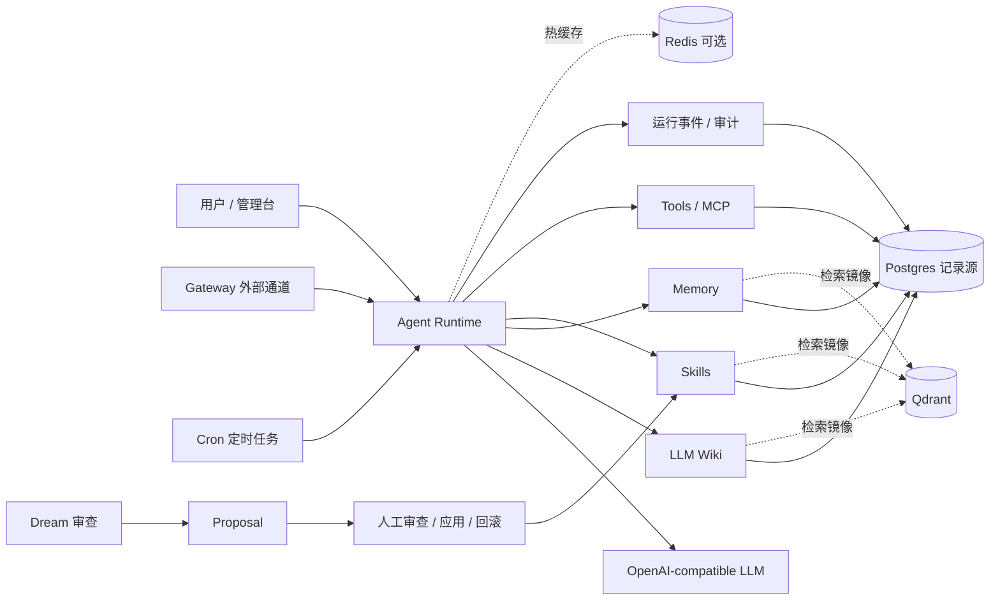
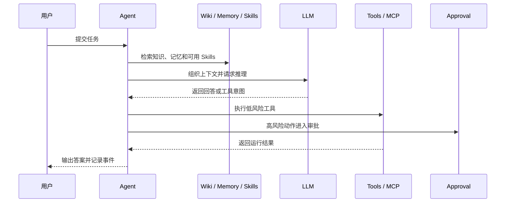
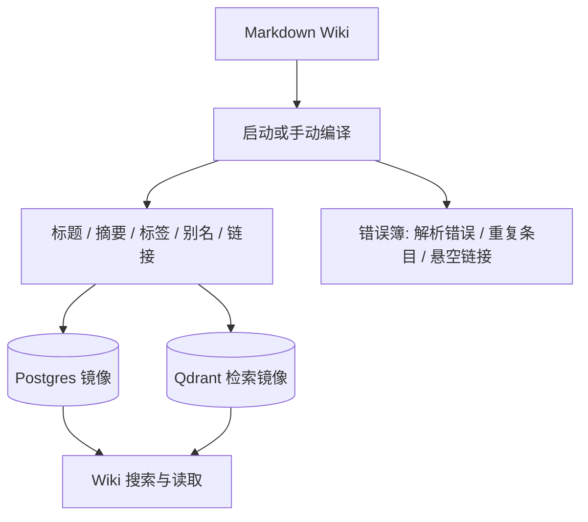
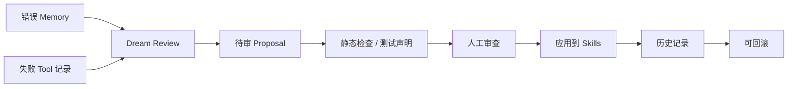
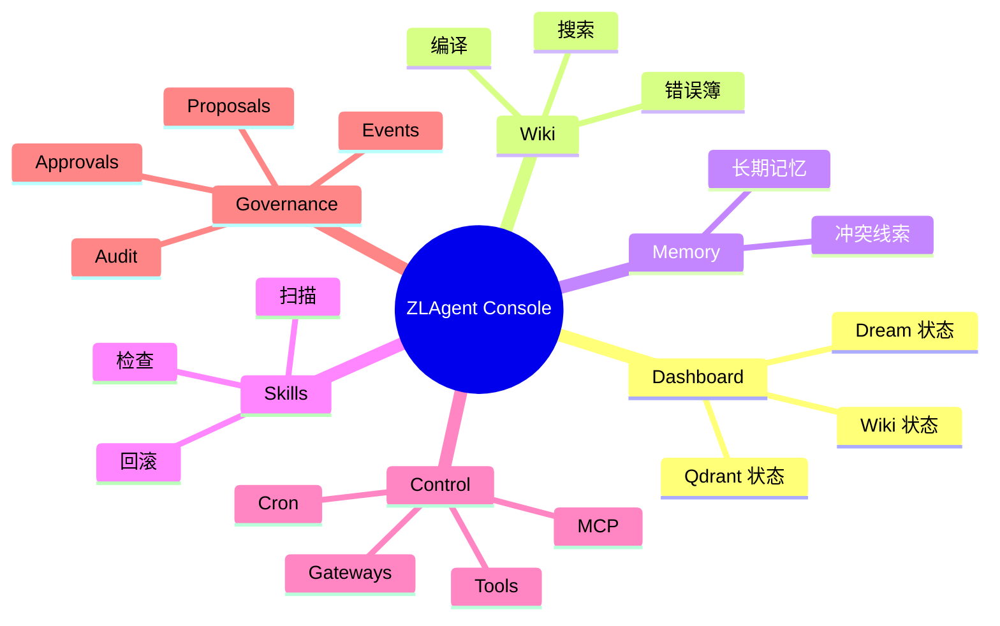

# ZLAgent

[English](README.en.md)


ZLAgent 是一个面向个人长期使用的 AI Agent 平台。它把长期知识、记忆、Skills、工具、MCP、Gateway、Cron、Approval 和 Dream 审查放在同一个可观察、可回滚、可持续进化的工作台里。

它不是一个只会转发聊天请求的壳，而是一个“有长期上下文的个人 Agent 操作系统”：Markdown Wiki 负责稳定知识，Memory 负责经验沉淀，Skills 负责可复用能力，Tools/MCP/Gateway 负责连接外部世界，Approval 和 Proposal 负责把风险动作留在人类审查边界内。



## 核心功能

| 能力 | 做什么 | 当前设计重点 |
|---|---|---|
| LLM Wiki | 用 Markdown 维护长期知识库，并提供搜索、读取、链接和错误簿 | Markdown 是权威来源，Postgres 和 Qdrant 都是可重建镜像 |
| Memory | 保存长期记忆、错误信号、工具经验和冲突线索 | 支持检索、验证、冲突观察，为 Dream 提供证据 |
| Skills | 管理可复用能力包，让 Agent 能沉淀稳定工作方法 | 支持扫描、归档、静态检查、Proposal 应用、历史记录和回滚 |
| Tools | 把工具调用纳入统一注册、运行记录和安全边界 | 每次调用都有运行状态、结果和审计线索 |
| MCP | 接入外部 MCP server，把发现到的能力映射成工具 | 启动默认刷新，但外部能力仍受 Approval 保护 |
| Gateway | 连接外部消息通道，支持入站任务和受控出站发送 | 默认关闭，必须显式启用 |
| Cron | 承载周期任务，例如 Dream 自动审查 | 定时任务可观察、可禁用、可追踪下一次运行 |
| Dream | 从错误 Memory 和失败工具记录中生成改进提案 | 默认定期运行，只生成 Proposal，不自动修改系统 |
| Approval | 对外部写入、高风险操作和 Proposal 应用加人工确认 | 把自动化能力限制在可审查边界内 |
| 管理台 | 查看 Wiki、Memory、Skills、Tools、Cron、MCP、Gateway、Proposals、Approvals、Runs、Audit、Settings | 项目运行状态集中可见 |

## 设计总览

### 一次 Agent 回合



### Wiki 编译链路



### Dream 自进化闭环



## 默认运行策略

ZLAgent 的默认值偏向“核心能力开箱即用，外部风险显式打开”。

| 项目 | 默认 | 说明 |
|---|---:|---|
| Wiki 启动编译 | 开启 | 启动时编译 Markdown Wiki，失败不阻断服务，但会留下运行事件 |
| Skills 启动扫描 | 开启 | 启动时扫描 Skills 并重建索引，失败不阻断服务 |
| Dream 周期审查 | 开启 | 默认每天 `03:30 Asia/Shanghai` 运行，只创建 Proposal |
| Qdrant | 开启 | 作为 Wiki、Memory、Skills 的检索镜像；不可用时降级到 Postgres 路径 |
| Redis | 可选 | 作为热缓存使用，缺失不影响启动 |
| MCP refresh | 开启 | 自动发现 MCP 工具，工具调用仍遵守 Approval 策略 |
| Gateway | 关闭 | 外部通道需要用户显式启用 |

主要配置项：

```env
ZLAGENT_BOOTSTRAP_WIKI_ON_STARTUP=true
ZLAGENT_BOOTSTRAP_SKILLS_ON_STARTUP=true
ZLAGENT_DREAM_REVIEW_ENABLED=true
ZLAGENT_DREAM_REVIEW_CRON=30 3 * * *
ZLAGENT_DREAM_REVIEW_TIMEZONE=Asia/Shanghai
ZLAGENT_QDRANT_ENABLED=true
ZLAGENT_MCP_REFRESH_ON_STARTUP=true
```

## 快速启动

### Docker 启动

```bash
cp .env.example .env
docker compose up -d --build
```

打开：

- 管理台：<http://localhost:8020>
- 健康检查：<http://localhost:8020/api/health>

默认管理员账号来自 `.env`：

```env
ZLAGENT_ADMIN_USERNAME=admin
ZLAGENT_ADMIN_PASSWORD=zlagent-admin
```

建议至少配置一个 OpenAI-compatible LLM：

```env
OPENAI_API_KEY=<your-llm-api-key>
OPENAI_BASE_URL=https://api.openai.com/v1
OPENAI_MODEL=<your-model>
```

未配置 LLM 时，服务仍可启动；Agent 会保留检索、状态和管理能力，但无法完成完整模型推理。

### 本地开发

```bash
python -m venv .venv
source .venv/bin/activate
pip install -e ".[dev]"
docker compose up -d postgres qdrant
uvicorn backend.app:app --host 127.0.0.1 --port 8020
```

前端独立开发：

```bash
npm install --prefix frontend
npm run dev --prefix frontend
```

## 运行与排障

### 前置依赖

| 依赖 | 版本 | 必需 | 说明 |
|---|---|---|---|
| Python | 3.11+ | 是 | 本地开发必需 |
| Docker Desktop | 当前稳定版 | 推荐 | 一键拉起应用、Postgres、Qdrant、Redis |
| Git | 任意 | 是 | 克隆代码 |
| Node.js / npm | 20+ | 建议 | MCP 生态里大量 server 使用 npm 分发 |
| `uv` / `uvx` | 当前稳定版 | 建议 | Python 类 MCP server 常用 |

LLM 使用 OpenAI-compatible 接口。没有配置 LLM key 时，服务仍可启动，但 Agent 只能返回检索和运行状态类响应。

### 观察

```bash
curl http://localhost:8020/api/health
docker compose logs -f zlagent
```

默认服务：

| 服务 | 端口 | 用途 |
|---|---|---|
| `zlagent` | 8020 | FastAPI + 管理台 |
| `zlagent-postgres` | 5432 | 系统记录源 |
| `zlagent-qdrant` | 6333 / 6334 | Wiki、Memory、Skills 检索镜像 |
| `zlagent-redis` | 6379 | 可选热缓存 |

### 管理台

- Dashboard：Wiki 页数、错误数、Qdrant 状态、Dream 审查状态。
- Wiki：编译、搜索、错误簿。
- Memory：长期记忆列表与新增。
- Skills：扫描、查看 Skills。
- Tools：工具清单与可用状态。
- Cron：定时任务，包括系统 Dream 审查任务。
- MCP：MCP server 配置与发现状态。
- Gateways：外部消息通道。
- Proposals：Dream 和人工创建的待审改进。
- Approvals：需要人工确认的外部写操作。
- Runs / Audit / Settings：运行记录、审计与配置状态。

### 常见问题

| 现象 | 检查 |
|---|---|
| `/api/health` 访问失败 | `docker compose ps`，确认 `zlagent` 容器是否 healthy |
| 登录失败 | `.env` 中管理员账号密码是否与数据库中的管理员一致 |
| LLM 没有回答 | `OPENAI_API_KEY`、`OPENAI_BASE_URL`、`OPENAI_MODEL` 是否都配置 |
| Qdrant 显示 Degraded | Qdrant 容器是否启动；首次 FastEmbed 模型下载是否完成 |
| Redis 不可用 | 可忽略；Redis 是热缓存，不是启动硬依赖 |
| Dream 没有自动运行 | 查看 Cron 中 `system-dream-review` 是否启用，以及 Settings 中下一次运行时间 |
| MCP 工具不可用 | MCP server 是否 enabled、是否 refresh 成功、工具是否因 Approval 被拦截 |
| Gateway 发送失败 | Gateway 是否 enabled，Webhook/Slack endpoint 是否有效 |

### 停止 / 清理

保留数据：

```bash
docker compose stop
docker compose down
```

清空数据卷：

```bash
docker compose down -v
```

这会清空 Postgres、Qdrant、Redis 和工作区卷中的数据。

## 工作区结构

| 路径 | 用途 |
|---|---|
| `workspace/knowledge/wiki` | LLM Wiki 的 Markdown 权威知识源 |
| `workspace/skills` | Skills 仓库 |
| `config/mcp_servers.yaml` | MCP server 配置入口 |
| `data` | 本地运行数据、缓存和模型缓存 |
| `.env.example` | 推荐配置模板 |

## 管理台视图



## 成熟度评估

| 方向 | 已经具备 | 仍需加强 | 判断 |
|---|---|---|---|
| LLM Wiki | Markdown 知识源、页面元数据、别名、标签、链接、错误簿、Postgres 镜像、Qdrant 检索、Wiki 搜索与读取 | 原始资料自动增量编译、事实级 provenance、目录页浏览策略、证据充分性检查、错误簿自动修复闭环 | 已具备平台底座，但还没有达到论文中完整“检索即推理”的成熟形态 |
| Dream 自进化记忆 | 能从错误 Memory 和失败工具记录生成 Proposal，且不会自动应用 | 长期记忆整理、去重、剪枝、分类迁移、回放验证和失败恢复 | 安全边界正确，目前更接近审查式提案生成器 |
| Skills | 扫描、归档、静态安全检查、Proposal 应用、历史记录、回滚 | 运行时 Skills 选择、引用文件渐进加载、命令式调用、自学习闭环、可验证复用策略 | 仓库管理清晰，但距离 Hermes 式按需加载和自学习仍有距离 |
| 外部工具治理 | Tools、MCP、Gateway、Cron、Approval、运行事件和审计统一管理 | 更细粒度的权限策略、跨工具风险评分、端到端回放测试 | 已形成可治理的控制面，适合继续扩展 |

## 与主流设计的关系

- 与 LLM-Wiki：ZLAgent 已经采用“结构化 Wiki + 检索镜像 + 错误簿”的方向，但当前重点仍是平台基础设施，不是完整论文级知识编译器。
- 与 Hermes / Agent Skills：ZLAgent 已经把 Skills 当成长期能力资产管理，但运行中按需选择、渐进加载和自学习能力仍需要继续补强。
- 与 nanobot Dream：ZLAgent 采用保守的 Dream 审查策略，让系统从失败经验中生成提案，同时避免无人审查的自动改写。

参考资料：

- LLM-Wiki paper: <https://arxiv.org/html/2605.25480v2>
- Hermes Skills: <https://hermes-agent.nousresearch.com/docs/user-guide/features/skills>
- Agent Skills specification: <https://agentskills.io/specification>
- nanobot Dream template: <https://github.com/HKUDS/nanobot/blob/main/nanobot/templates/agent/dream.md>
- nanobot project: <https://github.com/HKUDS/nanobot>

## 验证

```bash
PYTHONPATH=. pytest -q
ruff check backend tests
npm run build --prefix frontend
```

## 许可证

MIT License. 详见 [LICENSE](LICENSE)。
