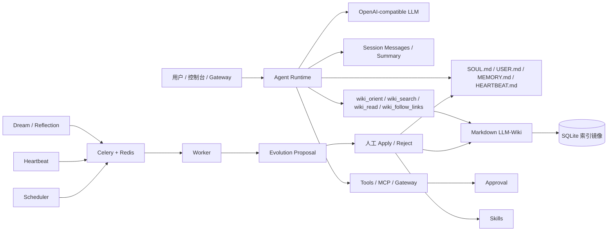

# ZLAgent

[English](README.en.md)


ZLAgent 是一个本地优先的长期个人 AI Agent。它把会话连续性、Markdown 权威记忆、Agent-native LLM-Wiki、Skills、工具/MCP/Gateway、审批、Dream/Reflection、Heartbeat 和后台任务队列放在同一个控制台里。

当前架构不再使用 Qdrant/chunk 候选召回作为默认路径。长期内容以 Markdown 文件为权威来源，SQLite 是本地状态库和索引镜像；搜索只是定位页面或记忆，事实证据必须通过 `wiki_read` 或 `memory_get` 读取原文。仓库里的默认长期内容放在 `workspace_seed/`，真实运行时内容位于本机私有的 `workspace/`，启动时只补缺失文件，不覆盖用户已有内容。



## 当前能力

| 能力 | 当前真实状态 |
|---|---|
| 会话连续性 | `session_messages` 保存 user/assistant/tool 消息，`session_summaries` 保存滚动摘要 |
| Markdown 权威文件 | 自动初始化 `SOUL.md`、`USER.md`、`memory/MEMORY.md`、`memory/history.jsonl`、`HEARTBEAT.md` |
| LLM-Wiki | Markdown 是事实源；SQLite/DB 表保存页面、链接、错误簿和编译状态 |
| Wiki 工具 | `wiki_orient` 看 schema/index/log/page map；`wiki_search` 查页面索引；`wiki_read` 读完整页面；`wiki_follow_links` 沿链接遍历 |
| Memory | `memory_search` 定位记忆，`memory_get` 读取记忆；创建记忆会同步追加到 `MEMORY.md` |
| Dream/Reflection | 进入 Celery 队列执行，生成 pending proposals，不直接改文件 |
| Heartbeat | 定时读取 `HEARTBEAT.md` 的 Active Tasks，生成待审批提案或记录 skipped |
| Skills | 扫描、lint、proposal apply/reject、历史记录和 rollback |
| Tools/MCP/Gateway | 工具统一注册和审计；高风险工具走 Approval；Gateway 支持 inbound/send/HMAC/heartbeat 状态 |
| 安全治理 | proposal apply/reject、工具审批、workspace 文件修改、cron/mcp/gateway 写操作都会进入审计 |

## LLM-Wiki 检索方式

默认主路径是 Agent 自主检索和读取：

```text
wiki_orient -> wiki_search 页面索引 -> wiki_read 页面原文 -> wiki_follow_links 多跳 -> 回答
```

`wiki_search` 不返回 chunk、snippet 或 `candidate_only`，只返回页面级索引信息。Agent 使用 Wiki 事实前应调用 `wiki_read`；如果只搜索/遍历但没有读取页面，运行时会记录 `wiki.retrieval_guard.warning`。

推荐 Wiki 目录运行在 `workspace/knowledge/wiki/`，默认模板在 `workspace_seed/knowledge/wiki/`：

```text
workspace_seed/knowledge/wiki/
  SCHEMA.md
  index.md
  log.md
  raw/
  entities/
  concepts/
  comparisons/
  queries/
  _archive/
```

## 长期文件

ZLAgent 对齐 OpenClaw、Hermes、nanobot 的长期文件风格。仓库模板是：

```text
workspace_seed/
  SOUL.md
  USER.md
  HEARTBEAT.md
  memory/
    MEMORY.md
    history.jsonl
  knowledge/wiki/
  skills/
```

启动后会 merge 到本机私有运行目录：

```text
workspace/
  SOUL.md
  USER.md
  HEARTBEAT.md
  memory/
    MEMORY.md
    history.jsonl
  knowledge/wiki/
  skills/
```

这些 Markdown 文件是人格、用户画像、长期记忆和主动任务的权威来源。数据库里的记录是索引、状态、任务、审计和可观察性镜像。`workspace/` 默认被 Git 忽略，适合保存真实个人长期上下文。

## 后台任务队列

重任务通过 Celery + Redis 执行，FastAPI 进程只负责对话、控制台、审批和查询状态。

| task_name | 做什么 |
|---|---|
| `dream_review` | 扫描错误记忆、失败 ToolRun、低稳定度记忆，生成 proposals |
| `heartbeat_check` | 读取 `HEARTBEAT.md` Active Tasks，生成 heartbeat proposal 或 skipped 记录 |
| `wiki_compile` | 编译 Markdown Wiki 到本地页面/链接/Error Book 索引 |
| `wiki_lint` | 检查 broken link、orphan page、missing index entry、low confidence、source drift |
| `skill_scan` | 扫描 Skills 并重建文件索引 |
| `mcp_refresh` | 刷新 MCP server 工具缓存 |

## 快速启动

### Docker Compose

```bash
cp .env.example .env
docker compose up -d --build
```

默认服务：

| 服务 | 用途 |
|---|---|
| `zlagent` | FastAPI + 前端控制台 |
| `zlagent-worker` | Celery worker |
| `zlagent-scheduler` | 扫描 `cron_jobs` 并 enqueue 到期任务 |
| `zlagent-redis` | Celery broker/result backend |

SQLite 数据默认在 `data/zlagent.sqlite3`。Postgres 仍可作为可选生产后端，通过 `ZLAGENT_DATABASE_URL` 切换。

打开：

- 控制台：<http://localhost:8020>
- 健康检查：<http://localhost:8020/api/health>

默认开发账号：

```env
ZLAGENT_ADMIN_USERNAME=admin
ZLAGENT_ADMIN_PASSWORD=zlagent-admin
```

### 本地开发

```bash
conda activate zlagent
python -m pip install -e ".[dev]"
PYTHONPATH=. uvicorn backend.app:app --host 127.0.0.1 --port 8020
```

启动 worker：

```bash
conda run -n zlagent env PYTHONPATH=. celery -A backend.worker.celery_app.celery_app worker --loglevel=INFO --concurrency=1
```

启动 scheduler：

```bash
conda run -n zlagent env PYTHONPATH=. python -m backend.worker.scheduler
```

前端开发：

```bash
npm install --prefix frontend
npm run dev --prefix frontend
```

## 关键 API

```text
GET/PUT /api/workspace/files/{soul|user|memory|heartbeat}
POST    /api/memory/search
GET     /api/memory/get?memory_id=...
GET     /api/wiki/search
GET     /api/wiki/read?page_key=...
POST    /api/heartbeat/run
GET     /api/heartbeat/status
POST    /api/gateways/{name}/heartbeat
GET     /api/gateways/status
GET     /api/jobs
POST    /api/evolution/proposals/{id}/apply
```

## 验证

```bash
conda run -n zlagent env PYTHONPATH=. pytest -q
cd frontend && npm run build
```

## 参考

- LLM-Wiki paper: <https://arxiv.org/abs/2605.25480>
- Hermes LLM-Wiki skill: <https://github.com/NousResearch/hermes-agent/blob/main/skills/research/llm-wiki/SKILL.md>
- nanobot: <https://github.com/HKUDS/nanobot>
- Celery periodic tasks: <https://docs.celeryq.dev/en/stable/userguide/periodic-tasks.html>
