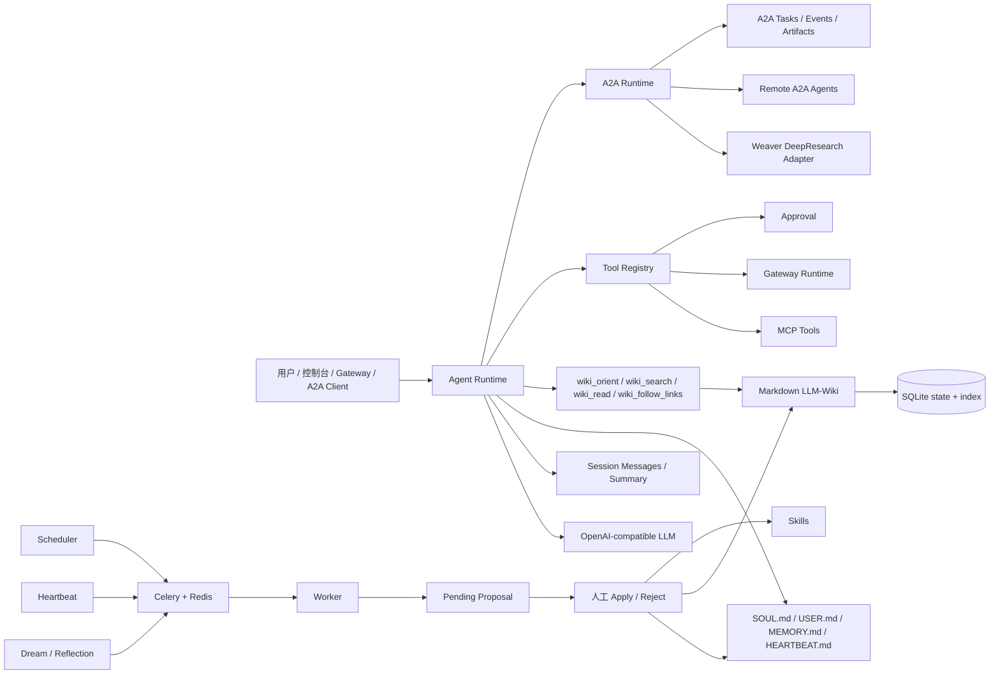

# SoulClaw

[English](README.en.md)


SoulClaw 是一个本地优先的长期个人 AI Agent，也是一个 A2A 多智能体编排节点。它把会话连续性、Markdown 权威记忆、Agent-native LLM-Wiki、Skills、工具/MCP/Gateway、审批、Dream/Reflection、Heartbeat、后台任务队列和 A2A 委托放在同一个可观测控制台里。

长期内容以 Markdown 文件为权威来源，SQLite 保存本地状态、索引镜像、审计、后台任务和 A2A 任务状态。搜索用于定位页面或记忆；使用事实前应通过 `wiki_read` 或 `memory_get` 读取原文。仓库模板位于 `workspace_seed/`，真实运行时内容位于本机私有 `workspace/`，启动时只补缺失文件，不覆盖已有个人数据。

A2A 与 MCP 的分工是：MCP 用于工具和数据源接入；A2A 用于 DeepResearch、文档项目、日程项目、代码编写这类粗粒度、可跟踪、可返回 artifacts 的外部 Agent 协作。SoulClaw 内置 A2A runtime、Agent Card、JSON-RPC endpoint、任务/事件/artifact 持久化，以及 Weaver DeepResearch 兼容适配。



## 功能概览

| 能力 | 说明 |
|---|---|
| 会话连续性 | `session_messages` 保存 user/assistant/tool 消息，`session_summaries` 保存滚动摘要 |
| Markdown 权威文件 | 自动初始化 `SOUL.md`、`USER.md`、`memory/MEMORY.md`、`memory/history.jsonl`、`HEARTBEAT.md` |
| LLM-Wiki | Markdown 是事实源；数据库表保存页面、链接、Error Book、编译状态和健康信息 |
| Wiki 工具 | `wiki_orient` 看 schema/index/log/page map；`wiki_search` 查页面索引；`wiki_read` 读完整页面；`wiki_follow_links` 沿链接遍历 |
| Memory | `memory_search` 定位记忆，`memory_get` 读取记忆；创建记忆会同步追加到 `MEMORY.md` |
| Skills | 扫描、lint、proposal apply/reject、历史记录和 rollback |
| Tools/MCP/Gateway | 工具统一注册和审计；高风险工具走 Approval；Gateway 支持 inbound/send/HMAC/heartbeat 状态 |
| A2A 多智能体 | 发布本地 Agent Card；支持 JSON-RPC `message/send`、`tasks/get`、`tasks/cancel`、`tasks/resubscribe`；保存连接、任务、事件和 artifacts |
| Weaver DeepResearch | 默认连接名 `weaver-deep-research`；通过 Weaver `/api/research/sse` 适配 DeepResearch 流事件、取消、最终报告和 evidence artifacts |
| Dream/Reflection | 进入 Celery 队列执行，生成 pending proposals，不直接改文件 |
| Heartbeat | 定时读取 `HEARTBEAT.md` 的 Active Tasks，生成待审批提案或记录 skipped |
| 后台任务 | 轻量模式下可由 API 进程触发；长期运行时可启用 Celery/Redis 执行 `dream_review`、`heartbeat_check`、`wiki_compile`、`wiki_lint`、`skill_scan`、`mcp_refresh` |
| 安全治理 | proposal apply/reject、工具审批、workspace 文件修改、cron/mcp/gateway/a2a 写操作都会进入审计 |

## A2A 多智能体

SoulClaw 会作为 orchestrator，把复杂任务委托给独立 Agent，而不是把外部 Agent 当作进程内函数。它提供两类接口：

```text
GET  /.well-known/agent-card.json
GET  /.well-known/agent-card
GET  /api/a2a/card
POST /api/a2a
```

`POST /api/a2a` 是公开 JSON-RPC endpoint，支持：

```text
message/send
message/stream
tasks/get
tasks/cancel
tasks/resubscribe
tasks/list
agent/getAuthenticatedExtendedCard
```

管理端接口需要登录：

```text
GET  /api/a2a/connections
POST /api/a2a/connections
POST /api/a2a/connections/{connection_name}/discover
POST /api/a2a/delegate
GET  /api/a2a/tasks
GET  /api/a2a/tasks/{task_id}
POST /api/a2a/tasks/{task_id}/cancel
GET  /api/a2a/tasks/{task_id}/events
```

默认 DeepResearch 适配配置：

```env
SOULCLAW_A2A_BOOTSTRAP_WEAVER_ENABLED=true
SOULCLAW_A2A_WEAVER_BASE_URL=http://127.0.0.1:8001
SOULCLAW_A2A_WEAVER_INTERNAL_API_KEY=
SOULCLAW_A2A_WEAVER_AUTH_USER_HEADER=X-Weaver-User
SOULCLAW_A2A_WEAVER_USER_ID=soulclaw
```

低风险读取/研究类任务可以自动委托；代码写入、日程修改、外部发送、文档写入等高风险 capability 会通过现有 Approval 机制拦截。

## LLM-Wiki 检索方式

默认主路径是 Agent 自主检索和读取：

```text
wiki_orient -> wiki_search 页面索引 -> wiki_read 页面原文 -> wiki_follow_links 多跳 -> 回答
```

`wiki_search` 不返回 chunk、snippet 或 `candidate_only`，只返回页面级索引信息。Agent 使用 Wiki 事实前应调用 `wiki_read`；如果只搜索/遍历但没有读取页面，运行时会记录 `wiki.retrieval_guard.warning`。

推荐 Wiki 目录运行在 `workspace/knowledge/wiki/`，默认模板在 `workspace_seed/knowledge/wiki/`：

```text
workspace_seed/knowledge/wiki/
  SCHEMA.md
  index.md
  log.md
  raw/
  entities/
  concepts/
  comparisons/
  queries/
  _archive/
```

## 长期文件

仓库包含一组长期文件模板：

```text
workspace_seed/
  SOUL.md
  USER.md
  HEARTBEAT.md
  memory/
    MEMORY.md
    history.jsonl
  knowledge/wiki/
  skills/
```

启动后会 merge 到本机私有运行目录：

```text
workspace/
  SOUL.md
  USER.md
  HEARTBEAT.md
  memory/
    MEMORY.md
    history.jsonl
  knowledge/wiki/
  skills/
```

这些 Markdown 文件是人格、用户画像、长期记忆和主动任务的权威来源。数据库里的记录是索引、状态、任务、审计和可观察性镜像。`workspace/` 默认被 Git 忽略，适合保存真实个人长期上下文。

## 快速启动

### Conda 本地开发

本地开发环境使用 conda 环境 `soulclaw`：

```bash
conda activate soulclaw
python -m pip install -e ".[dev]"
PYTHONPATH=. uvicorn backend.app:app --host 127.0.0.1 --port 8020
```

前端开发：

```bash
npm install --prefix frontend
npm run dev --prefix frontend
```

启动 worker：

```bash
conda run -n soulclaw env PYTHONPATH=. celery -A backend.worker.celery_app.celery_app worker --loglevel=INFO --concurrency=1
```

启动 scheduler：

```bash
conda run -n soulclaw env PYTHONPATH=. python -m backend.worker.scheduler
```

### Docker Compose

```bash
cp .env.example .env
docker compose up -d --build
```

默认轻量服务：

| 服务 | 用途 |
|---|---|
| `soulclaw` | FastAPI + 前端控制台；默认使用 SQLite，本地不强制 Redis |

本地需要后台队列时再显式启用 background profile：

```bash
docker compose --profile background up -d --build
```

| 可选服务 | 用途 |
|---|---|
| `soulclaw-worker` | Celery worker |
| `soulclaw-scheduler` | 扫描 `cron_jobs` 并 enqueue 到期任务 |
| `soulclaw-redis` | Celery broker/result backend |

如果想在本地演练 Postgres，可单独启用 postgres profile 并把 `SOULCLAW_DATABASE_URL` 切到 Postgres：

```bash
docker compose --profile postgres up -d postgres
```

SQLite 数据默认在 `data/soulclaw.sqlite3`。Redis 在轻量模式下只是可选热缓存/队列依赖，未启动也不会让 readiness 失败。Postgres 可作为可选生产后端，通过 `SOULCLAW_DATABASE_URL` 切换。项目目录是：

```text
/home/song/code/Agent/assistant/SoulClaw
```

打开：

- 控制台：<http://localhost:8020>
- 健康检查：<http://localhost:8020/api/health>
- Agent Card：<http://localhost:8020/.well-known/agent-card.json>

### 个人服务器生产部署

生产部署使用 Postgres + Redis + app + worker + scheduler，作为长期个人服务器形态；默认日常启动仍是单应用 + SQLite 的轻量形态。生产 app 端口默认只绑定 `127.0.0.1:8020`，建议放在外部 Caddy、Nginx 或 Cloudflare Tunnel 后面处理 TLS、域名和公网访问控制。

```bash
cp .env.production.example .env.production
# 编辑 .env.production，替换所有密码、JWT secret、CORS、公开 URL 和 A2A 公网鉴权值
docker compose --env-file .env.production -f docker-compose.prod.yml up -d --build
```

生产 compose 会强制要求关键变量，例如 `SOULCLAW_ADMIN_PASSWORD`、`SOULCLAW_JWT_SECRET`、`SOULCLAW_POSTGRES_PASSWORD`、`SOULCLAW_CORS_ORIGINS`、`SOULCLAW_PUBLIC_BASE_URL` 和 `SOULCLAW_A2A_PUBLIC_API_KEY`，并显式要求 Redis 可用。如果生产环境配置成 SQLite，后端会拒绝启动。

默认开发账号：

```env
SOULCLAW_ADMIN_USERNAME=admin
SOULCLAW_ADMIN_PASSWORD=soulclaw-admin
```

生产环境必须修改 `SOULCLAW_JWT_SECRET`、`SOULCLAW_ADMIN_PASSWORD`，并显式设置 CORS。

## 关键 API

```text
POST    /api/auth/login
GET     /api/health
GET     /api/health/live
GET     /api/health/ready

GET/PUT /api/workspace/files/{soul|user|memory|heartbeat}

GET     /api/wiki/orient
GET     /api/wiki/search?q=...
POST    /api/wiki/search
GET     /api/wiki/read?page_key=...
POST    /api/wiki/compile
POST    /api/wiki/lint

GET     /api/memory
POST    /api/memory
POST    /api/memory/search
GET     /api/memory/get?memory_id=...

GET     /api/tools
POST    /api/tools/{tool_name}/run
GET     /api/approvals
POST    /api/approvals/{approval_id}/approve-and-run
POST    /api/approvals/{approval_id}/resume-turn

GET     /api/a2a/connections
POST    /api/a2a/delegate
GET     /api/a2a/tasks
POST    /api/a2a/tasks/{task_id}/cancel
POST    /api/a2a

GET     /api/mcp
POST    /api/mcp/refresh
GET     /api/gateways/status
POST    /api/gateways/inbound
POST    /api/gateways/send

GET     /api/jobs
POST    /api/jobs/{job_id}/cancel
POST    /api/heartbeat/run
GET     /api/heartbeat/status
POST    /api/evolution/proposals/{id}/apply
```

## 验证

```bash
conda run -n soulclaw env PYTHONPATH=. pytest -q
conda run -n soulclaw env PYTHONPATH=. ruff check backend tests
npm ci --prefix frontend
npm run build --prefix frontend
docker build -t soulclaw:local .
docker compose --env-file .env.production.example -f docker-compose.prod.yml config
```

CI 使用同一组质量门禁：Python 3.11 后端测试、ruff、Node 20 前端构建、Docker build，以及 SQLite/Postgres 迁移验证。

## 参考

- A2A specification: <https://a2a-protocol.org/latest/specification/>
- A2A and MCP: <https://a2a-protocol.org/latest/topics/a2a-and-mcp/>
- Agent Discovery: <https://a2a-protocol.org/latest/topics/agent-discovery/>
- A2A Python SDK: <https://github.com/a2aproject/a2a-python>
- LLM-Wiki paper: <https://arxiv.org/abs/2605.25480>
- Hermes LLM-Wiki skill: <https://github.com/NousResearch/hermes-agent/blob/main/skills/research/llm-wiki/SKILL.md>
- nanobot: <https://github.com/HKUDS/nanobot>
- Celery periodic tasks: <https://docs.celeryq.dev/en/stable/userguide/periodic-tasks.html>
