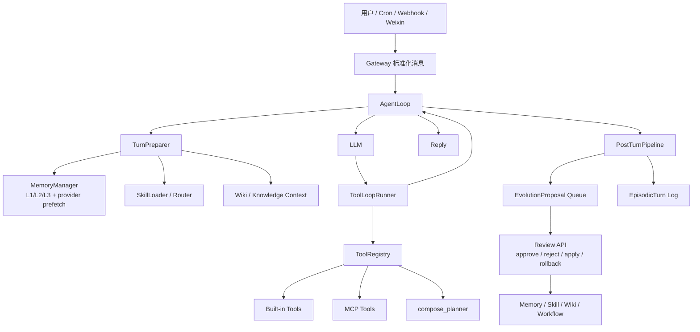

# ZLAgent

面向个人长期使用的 IM 优先 AI 助手 / Personal AI OS 原型。


项目演示视频：[bilibili.com/video/BV1bc5S6dEq6](https://www.bilibili.com/video/BV1bc5S6dEq6/)


> 当前代码版本号仍为 `1.2.2`。本 README 描述的是当前 `main` 分支的真实功能面，包括刚加入的长期自进化审查层、compose planner、durable wiki export 和 memory metadata。

---

## 项目定位

ZLAgent 不是一个通用多租户 SaaS，也不是单纯的聊天机器人框架。它的目标是成为一个可长期运行、可审查自进化、能接入 IM 的个人 AI OS：

- 通过微信、Webhook、定时任务等入口接收自然语言请求
- 根据当前任务选择少量相关 skills、memory、wiki context 和工具
- 通过内置工具与 MCP 工具完成搜索、文件、提醒、知识写入、消息投递等工作
- 把可复用的经验沉淀为 memory、wiki fact、compose recipe 或 skill proposal
- 所有高价值自进化变更先进入 `EvolutionProposal` 审查队列，批准后才进入生产状态

核心原则：

```text
少量上下文 + 受控工具 + 可审查长期记忆 + 可回滚自进化
```

---

## 当前真实状态

### 已实现

- FastAPI 后端、运行时装配、工具注册表、OpenAI-compatible LLM client
- IM / Gateway 抽象，包含个人微信 iLink、Webhook、WeCom Bot outbound 代码路径
- Tool loop、权限确认、失败防护、上下文压缩、turn scope
- 内置工具：文件读写、网页读取/搜索、代码执行、记忆管理、技能管理、知识写入、MCP 管理、定时任务、消息发送、compose planning
- MCP stdio / HTTP 连接、运行时注册、安装日志、权限包装
- Skills 文件加载、`SKILL.md` frontmatter 扩展、skill guard、usage/history 侧车
- 三层长期记忆：L1 control axioms、L2 agent notes、L3 user facts
- Episodic turn log、semantic memory lexical sidecar、memory importance/confidence/stability 元数据
- Wiki answer cache、atomic fact 字段、source/alias/confidence/superseded 字段
- Durable wiki export：把 `wiki_entries` 导出为 `workspace/knowledge/wiki/cache/` 下的 Markdown/frontmatter 页面
- `EvolutionProposal` 审查队列，统一管理 memory / skill / wiki / workflow 的候选变更
- Review API：proposal list/create/approve/reject/apply/rollback
- Compose planner：把用户目标、可用 skills/tools/MCP 汇成 JSON execution plan，可生成 workflow proposal
- Post-turn pipeline：记录 turn、排队 review、为多工具任务生成 compose recipe proposal

### 有意保持受控

- 后台 review 不直接静默改写长期记忆；`memory_manage` 在 `background_review` 中只创建 proposal
- `skill_manage` 默认只创建 proposal；只有审查 API 调用 `apply_approved` 才写入 `SKILL.md`
- wiki cache 可作为低风险 answer cache 自动写入；durable wiki 导出与 atomic fact 维护走显式 API / proposal
- destructive / write / install / send 类工具仍走权限、确认、guardrails 和观测日志

### 当前边界

- 代码默认数据库仍是 SQLite：`sqlite:////app/data/zlagent.db`
- `docker-compose.yml` 包含 Postgres + Redis 服务；若要让应用实际使用 Postgres，需要显式设置 `ZLAGENT_DATABASE_URL`，并确保镜像中安装对应驱动
- 当前 `requirements.txt` 未列出 `psycopg`，所以默认推荐先使用 SQLite fallback；Postgres/pgvector 是后续可切换 provider 方向
- Neo4j / Qdrant / Milvus 不是 v1 强依赖；图谱和语义索引当前用 SQLAlchemy 表、JSON、Markdown 和缓存文件完成
- 企业微信群机器人、通用 Webhook 属于代码路径可用，但需要按部署环境自行实测

---

## 架构总览



### 关键模块

| 模块 | 作用 |
|---|---|
| `backend/app.py` | FastAPI 入口与 lifespan |
| `backend/bootstrap/` | 组装 LLM、skills、memory、tools、MCP、services、routes |
| `backend/agent/` | 主 turn 流程、tool loop、上下文、路由、post-turn review |
| `backend/tools/` | 工具抽象、注册表、内置工具 |
| `backend/memory/` | 长期记忆、turn log、provider 接口、检索与注入 |
| `backend/evolution/` | 自进化 proposal store |
| `backend/skills/` | Skill loader、guard、usage/history、curator/daily review |
| `backend/wiki/` | answer cache、atomic fact 字段、durable Markdown export |
| `backend/mcp/` | MCP 配置、安装、连接、tool wrapper、生命周期 |
| `backend/gateways/` | 微信、Webhook、WeCom Bot 等消息通道 |
| `backend/harness/` | 扩展清单、可观测性、工具 memo、progress |

---

## 自进化审查机制

ZLAgent 当前的自进化入口统一进入 `EvolutionProposal`，字段包括：

- `target_type`: `memory` / `skill` / `wiki` / `workflow`
- `action`: 例如 `remember`、`consolidate`、`create`、`patch`、`add_atomic_fact`、`compose_recipe`
- `payload_json`: 候选变更内容
- `evidence_json`: 证据、触发来源、turn 信息
- `confidence`: 置信度
- `risk_level`: `low` / `medium` / `high` / `critical`
- `status`: `pending` / `approved` / `rejected` / `applied` / `failed` / `rolled_back`
- `before_json` / `after_json` / `result_json`: apply 前后快照和结果，用于审计与 rollback

### Review API

| 方法 | 路径 | 说明 |
|---|---|---|
| `GET` | `/api/review/proposals` | 查看候选变更 |
| `POST` | `/api/review/proposals` | 手动创建候选变更 |
| `GET` | `/api/review/proposals/{id}` | 查看单个 proposal |
| `POST` | `/api/review/proposals/{id}/approve` | 批准 |
| `POST` | `/api/review/proposals/{id}/reject` | 拒绝 |
| `POST` | `/api/review/proposals/{id}/apply` | 应用到生产状态 |
| `POST` | `/api/review/proposals/{id}/rollback` | 尽量回滚已应用变更 |
| `GET` | `/api/review/state` | daily review 状态 + proposal 统计 |
| `POST` | `/api/review/run` | 手动触发 daily review |

### 典型流转

```text
用户完成复杂任务
  -> PostTurnPipeline 生成 workflow proposal
  -> 人工查看 /api/review/proposals
  -> approve
  -> apply
  -> workspace/compose_recipes/<name>.json
  -> 下次 compose_planner / skill review 可复用
```

---

## 长期记忆

ZLAgent 仍保留三层记忆模型：

| 层级 | kind | 内容 |
|---|---|---|
| L1 | `control_axiom` | 系统级控制论思考原则，默认 seed，通常 pinned |
| L2 | `agent_note` | agent 自己的抽象经验、触发条件、失败信号 |
| L3 | `user_fact` | 用户偏好、身份、长期项目、稳定事实 |

新增字段：

- `importance`
- `confidence`
- `stability`
- `last_verified_at`
- `supersedes`
- `source_turn_id`
- `metadata_json`

新增表：

- `episodic_turns`: append-only turn log，作为自进化证据，不直接进入 prompt
- `semantic_memory_index`: lexical terms + optional embedding JSON 的语义检索 sidecar

前台用户明确要求“记住”时可以直接写入；后台 review 自动发现的记忆候选先进入 proposal，不再静默写生产记忆。

---

## Skills

Skills 使用 Hermes-style `SKILL.md` 为主，legacy `skill.yaml + instructions.md` 仍兼容。

当前扩展的 `metadata.zlagent` frontmatter 字段：

```yaml
metadata:
  zlagent:
    capabilities: []
    inputs: []
    outputs: []
    required_tools: []
    compose_examples: []
    test_cases: []
    approval_level: review
    related_skills: []
```

Skill 路由不再只靠简单 substring trigger，而会综合：

- triggers
- tags
- capabilities
- inputs / outputs
- name / description
- fuzzy ratio / term overlap

`skill_manage` 的默认行为：

- `create` / `edit` / `patch` / `write_file` / `remove_file` / `delete` / `archive` / `import_from_url` 默认只创建 proposal
- `apply_approved` 由 review API 调用，用于实际写文件
- `pin` / `unpin` 仍是直接状态操作
- `SkillGuard` 会在实际写入前扫描危险内容

---

## Wiki 与知识库

当前有两条路线：

### 1. Wiki answer cache

`backend/wiki/store.py` 管理 `wiki_entries`，用于技能问答缓存：

- `skill_id`
- raw / normalized query
- answer
- TTL
- confidence
- sources
- aliases
- superseded_by
- crystal_kind: `answer` / `atomic_fact` 等
- geo_path

### 2. Durable LLM Wiki export

`POST /api/wiki/export-durable` 会把 `wiki_entries` 导出到：

```text
workspace/knowledge/wiki/cache/
  index.md
  facts/*.md
  sources/*.md
```

导出页面包含 JSON frontmatter、来源链、置信度、superseded 状态和审计信息。它不是替代 answer cache，而是让缓存事实变成可读、可审查、可版本化的 Markdown 知识库。

---

## Compose Use

新增 `compose_planner` 工具，用于把用户目标转成可审查执行计划。

输入：

- `goal`
- `max_steps`
- `create_proposal`

输出 JSON：

- selected skills
- candidate tools
- steps
- dependencies
- parallel group
- risk level
- confirmation points

如果 `create_proposal=true`，会生成 `target_type=workflow`、`action=compose_recipe` 的 proposal。真正执行仍复用 `ToolLoopRunner`、权限策略、guardrails 和观测日志。

---

## 内置工具概览

| 工具 | 作用 |
|---|---|
| `tool_search` | 在注册工具中检索能力 |
| `read_file` / `write_file` | 工作区文件读写 |
| `read_url` / `web_search` | 外部资料读取与搜索 |
| `memory_manage` | 长期记忆 recall/list/remember/consolidate 等 |
| `skill_manage` | skill 变更 proposal 与 approved apply |
| `knowledge_ingest` | 写入文件型知识库 |
| `knowledge_inspect` / `knowledge_mode_manage` | 知识模式查看与管理 |
| `mcp_manage` | MCP server 安装、注册、重连、移除、权限提升 |
| `cron_manage` | 定时任务管理 |
| `send_message` | 通过 gateway 发消息 |
| `delegate` | 委派子任务给 agent loop |
| `code_execution` | 受限代码执行 |
| `compose_planner` | 多工具/多 skill 组合规划 |

---

## 快速开始

### 1. 克隆

```bash
git clone https://github.com/LittleSongxx/ZLAgent.git
cd ZLAgent
```

### 2. 配置 LLM

```bash
cp .env.example .env
```

至少配置：

```env
OPENAI_API_KEY=your-key
OPENAI_BASE_URL=https://api.openai.com/v1
OPENAI_MODEL=gpt-4.1-mini
```

DeepSeek、Qwen、OpenRouter 等 OpenAI-compatible 服务也可以，只要 base url 和 model 对应即可。

### 3. Docker 启动

```bash
docker compose up -d --build
```

默认服务：

| 服务 | 说明 |
|---|---|
| `zlagent` | FastAPI 主应用，端口 `8020` |
| `redis` | 可选热缓存、session context、travel bundle cache |
| `postgres` | compose 中保留的 Postgres/pgvector 服务 |
| `weixin-login` | setup profile，一次性扫码绑定个人微信 |

重要说明：

- 当前代码原生读取 `ZLAGENT_DATABASE_URL`
- 未设置时使用 SQLite：`/app/data/zlagent.db`
- 如要尝试 Postgres，请在 `.env` 中设置 `ZLAGENT_DATABASE_URL=postgresql+psycopg://...`，并补齐 Python driver
- `.env.example` 中的 `DATABASE_URL` 是旧 compose 变量；当前 Python Settings 不读取它

### 4. 本地 Python 启动

```bash
python -m venv .venv
source .venv/bin/activate
pip install -r requirements.txt
python -m uvicorn backend.app:app --host 0.0.0.0 --port 8020
```

Windows PowerShell：

```powershell
python -m venv .venv
.\.venv\Scripts\Activate.ps1
pip install -r requirements.txt
python -m uvicorn backend.app:app --host 0.0.0.0 --port 8020
```

### 5. 健康检查

```bash
curl http://localhost:8020/api/health
curl http://localhost:8020/api/info
curl http://localhost:8020/api/doctor
```

Swagger：

```text
http://localhost:8020/docs
```

---

## 微信接入

个人微信使用 vendored Hermes iLink 协议实现。推荐流程：

```bash
docker compose run --rm weixin-login
```

流程会：

1. 终端打印二维码
2. 手机微信扫码
3. 凭据写入 `workspace/credentials/weixin/accounts/<account_id>.json`
4. 调用 `/api/gateways/weixin/reload`
5. 注册 `DeliveryTarget`
6. 发送测试消息

常用排查：

| 现象 | 处理 |
|---|---|
| reload 报 gateway not registered | 检查 `aiohttp`、`cryptography`、`qrcode` 依赖 |
| 扫码后超时 | 检查网络是否能访问 iLink 服务 |
| 测试消息 `ret=-2` | 多为临时限流，等 1-3 分钟后重试 |
| 改 `.env` 不生效 | 需要 `docker compose up -d --force-recreate zlagent` |

---

## API 概览

| 功能 | 路径 |
|---|---|
| 根页面 | `GET /` |
| 健康检查 | `GET /api/health` |
| 运行时信息 | `GET /api/info` |
| 运行时状态 | `GET /api/runtime` |
| 八组件自检 | `GET /api/doctor` |
| LLM 状态 / 测试 | `GET /api/llm/status`, `POST /api/llm/test` |
| 工具列表 / 测试 | `GET /api/tools`, `POST /api/tools/{name}/test` |
| Harness 扩展 | `GET /api/harness/extensions` |
| Harness 指标 | `GET /api/harness/metrics` |
| 记忆 | `GET/POST /api/memory`, `POST /api/memory/consolidate` |
| 记忆 pin/archive | `POST /api/memory/{id}/pin`, `/archive`, `/unarchive` |
| Wiki cache | `GET /api/wiki`, `POST /api/wiki/refresh` |
| Durable wiki export | `POST /api/wiki/export-durable` |
| Review proposals | `GET/POST /api/review/proposals` |
| Proposal approve/apply/rollback | `POST /api/review/proposals/{id}/approve`, `/apply`, `/rollback` |
| Daily review | `GET /api/review/state`, `POST /api/review/run` |
| Review log | `GET /api/review/log`, `POST /api/review/log/{run_id}/rollback` |
| Skills | `GET /api/skills` |
| Curator | `POST /api/curator/run` |
| Cron | `GET/POST /api/cron` |
| Delivery targets | `GET/POST /api/delivery-targets` |
| Confirmations | `GET /api/confirmations` |
| MCP | `/api/mcp/*` |
| Gateways | `GET /api/gateways` |
| Weixin | `/api/gateways/weixin/*` |
| Knowledge bases | `/api/knowledge-bases/*` |
| GraphRAG | `GET /api/graph-rag` |
| Maintenance / nightly | `/api/maintenance/*`, `/api/nightly/*` |

---

## 配置重点

完整配置见 `backend/core/config.py`。

常用项：

```env
# LLM
OPENAI_API_KEY=
OPENAI_BASE_URL=https://api.openai.com/v1
OPENAI_MODEL=

# Router LLM
ZLAGENT_ROUTER_LLM_ENABLED=false
ZLAGENT_ROUTER_LLM_MODEL=

# Database
ZLAGENT_DATABASE_URL=sqlite:///./data/zlagent.db

# Redis
ZLAGENT_REDIS_URL=redis://redis:6379/0

# Memory
ZLAGENT_MEMORY_MAX_ENTRIES=200
ZLAGENT_MEMORY_MAX_ENTRY_CHARS=500
ZLAGENT_MEMORY_MAX_FACT_CHARS=280

# Review
ZLAGENT_AGENT_REVIEW_ENABLED=true
ZLAGENT_DAILY_REVIEW_ENABLED=true

# MCP
ZLAGENT_MCP_ENABLED=true

# Graph extraction
ZLAGENT_GRAPH_LLM_ENABLED=true

# Plugins
ZLAGENT_PLUGINS_ENABLED=false

# Server
ZLAGENT_HOST=0.0.0.0
ZLAGENT_PORT=8020
ZLAGENT_LOG_LEVEL=INFO
```

---

## 验证

本次 README 更新前，当前功能层已做过以下验证：

```bash
python -m compileall backend
```

以及离线 smoke：

- background review 调 `memory_manage(remember)` 只生成 memory proposal，不直接写入 memory
- 对 memory proposal 执行 apply 后，才写入 `source=review` 的 memory row
- `skill_manage(create)` 默认只生成 skill proposal，不写 `SKILL.md`
- `apply_approved` 后才生成带 `metadata.zlagent` frontmatter 的 `SKILL.md`
- `create_app()` 可成功构建 FastAPI app
- `git diff --check` 无空白错误

如果要在 Docker 容器内验证：

```bash
docker compose exec -T zlagent python -m compileall -q backend
docker compose exec -T zlagent python scripts/mcp_e2e_check.py
docker compose exec -T zlagent python scripts/mcp_e2e_http_check.py
docker compose exec -T zlagent env ZLAGENT_DEMO_FAST=1 python scripts/demo_e2e.py
```

注意：Docker 镜像默认只复制 `backend/`、`workspace/` 和入口脚本；如果要跑 `scripts/`，需要先复制到容器。

---

## 适用场景

适合：

- 个人 IM 常驻助手
- 长期记忆型私人助理
- 需要受控自进化的 agent 实验
- 需要 Skills + MCP + Wiki + Workflow compose 的个人 AI OS 原型
- 论文、旅行、日报、提醒、知识整理、工具安装等高频个人任务

不适合：

- 无审核自动改写生产技能的系统
- 强事务在线业务主系统
- 大规模多人协作知识库平台
- 高频金融交易或强实时控制系统

---

## 许可与上游来源

本项目代码以 MIT License 发布。

主要参考 / vendored 来源：

- [NousResearch/hermes-agent](https://github.com/NousResearch/hermes-agent)
  - 参考长期记忆、skills、工具安全、历史压缩、微信 iLink 协议
  - `backend/gateways/_vendor/weixin_ilink.py` 是精简移植并保留 MIT 文头
- [openclaw/openclaw](https://github.com/openclaw/openclaw)
  - 参考个人 agent 工具安全、MCP 组合能力和权限边界
- [nvk/llm-wiki](https://github.com/nvk/llm-wiki)
  - 参考可复用 answer cache、atomic fact、来源链与 durable wiki 思路
- [shareAI-lab/learn-claude-code](https://github.com/shareAI-lab/learn-claude-code)
  - 参考 agent 工程组织方式
- [andrej-karpathy-skills](https://github.com/forrestchang/andrej-karpathy-skills)
  - 参考 coding principles，并改写进系统提示词

公开分发时建议继续补充独立的 `THIRD_PARTY_NOTICES.md`，集中登记 vendored 文件、MIT 全文和改编范围。
